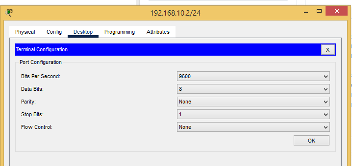
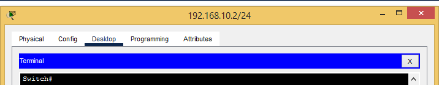

# Лабораторная работа. Базовая настройка коммутатора.
###  Задание:

  **1. Часть 1. Проверка конфигурации коммутатора по умолчанию;**
  
  **2. Часть 2. Создание сети и настройка основных параметров устройства;**
  * Настройте базовые параметры коммутатора;
  * Настройте IP-адрес для ПК;

  **3. Часть 3. Проверка сетевых подключений;**
  * Отобразите конфигурацию устройства.
  * Протестируйте сквозное соединение, отправив эхо-запрос.
  * Протестируйте возможности удаленного управления с помощью Telnet.
###  Решение:
**1. Часть 1.  В симуляторе CPT создадим топологию устройств согласно условию работы.**
   

|    Устройство    |   Интерфейс    |   IP-адрес / префикс     |
|-----------------:|:---------------|-------------------------:|
|      SW2960      |      FA0/1     | 192.168.10.3/24          | 
|      PC-PT       |      FA0       | 192.168.10.2/24          |
2. Для первоначальной настройки коммутатора подключимся к нему консольным кабелем. На PC выберем "подключение через терминал", настройки оставим по умолчанию.



3. Установим соединение к коммутатору через консоль. 



4. Введём в CLI комманду "enable" и далее "show running-config". Получим вывод конфигурации "по умолчанию"

```
Building configuration...

Current configuration : 1080 bytes
!
version 15.0
no service timestamps log datetime msec
no service timestamps debug datetime msec
no service password-encryption
!
hostname Switch
!
!
!
!
!
!
spanning-tree mode pvst
spanning-tree extend system-id
!
interface FastEthernet0/1
!
interface FastEthernet0/2

Switch#sh running-config   
Building configuration...

Current configuration : 1080 bytes
!
version 15.0
no service timestamps log datetime msec
no service timestamps debug datetime msec
no service password-encryption
!
hostname Switch
!
!
!
!
!
!
spanning-tree mode pvst
spanning-tree extend system-id
!
interface FastEthernet0/1
!
interface FastEthernet0/2
!
interface FastEthernet0/3
!
interface FastEthernet0/4
!
interface FastEthernet0/5
!
interface FastEthernet0/6
!
interface FastEthernet0/7
!
interface FastEthernet0/8
!
interface FastEthernet0/9
!
interface FastEthernet0/10
!
interface FastEthernet0/11
!
interface FastEthernet0/12
!
interface FastEthernet0/13
!
interface FastEthernet0/14
!
interface FastEthernet0/15
!
interface FastEthernet0/16
!
interface FastEthernet0/17
!
interface FastEthernet0/18
!
interface FastEthernet0/19
!
interface FastEthernet0/20
!
interface FastEthernet0/21
!
interface FastEthernet0/22
!
interface FastEthernet0/23
!
interface FastEthernet0/24
!
interface GigabitEthernet0/1
!
interface GigabitEthernet0/2
!
interface Vlan1
 no ip address
 shutdown
!
!
!
!
line con 0
!
line vty 0 4
 login
line vty 5 15
 login
!
!
!
!
end
```

 
