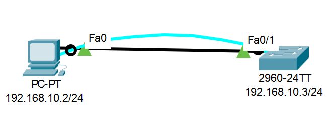

# Лабораторная работа. Базовая настройка коммутатора.
###  Задание:

  **1. Часть 1. Проверка конфигурации коммутатора по умолчанию;**
  
  **2. Часть 2. Создание сети и настройка основных параметров устройства;**
  * Настройте базовые параметры коммутатора;
  * Настройте IP-адрес для ПК;

  **3. Часть 3. Проверка сетевых подключений;**
  * Отобразите конфигурацию устройства.
  * Протестируйте сквозное соединение, отправив эхо-запрос.
  * Протестируйте возможности удаленного управления с помощью Telnet.
###  Решение:
1. В симуляторе CPT создадим топологию устройств согласно условию работы.
   

|    Устройство    |   Интерфейс    |   IP-адрес / префикс     |
|-----------------:|:---------------|-------------------------:|
|      SW2960      |      FA0/1     | 192.168.10.3/24          | 
|      PC-PT       |      FA0       | 192.168.10.2/24          |
2. Для первоначальной настройки коммутатора подключимся к нему консольным кабелем. На PC выберем "подключение через терминал", настройки оставим по умолчанию.

