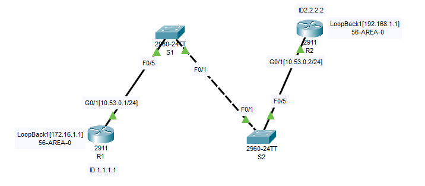

# Лабораторная работа. Настройка протокола OSPFv2 для одной области

## Топология



## Таблица адресации


## Цели

## Часть 1. Создание сети и настройка основных параметров устройства

## Часть 2. Настройка и проверка базовой работы протокола  OSPFv2 для одной области

## Часть 3. Оптимизация и проверка конфигурации OSPFv2 для одной области

## __________________________________________________

## Ход работы

## Часть 1. Создание сети и настройка основных параметров устройства

### Шаг 1. Создайте сеть согласно топологии.

**Подключите устройства, как показано в топологии, и подсоедините необходимые кабели.**

### Шаг 2. Произведите базовую настройку маршрутизаторов.

**a.	Назначьте маршрутизатору имя устройства.**
```
hostname R1
```
**b.	Отключите поиск DNS, чтобы предотвратить попытки маршрутизатора неверно преобразовывать введенные команды 
таким образом, как будто они являются именами узлов.**
```
no ip domain-lookup
```
**c.	Назначьте cisco в качестве зашифрованного пароля привилегированного режима EXEC.**
```
enable secret 5 $1$mERr$hx5rVt7rPNoS4wqbXKX7m0
```
**d.	Назначьте cisco в качестве пароля консоли и включите вход в систему по паролю.**
```
line con 0
 login local
```
**e.	Назначьте cisco в качестве пароля VTY и включите вход в систему по паролю.**
```
line vty 0 4
 login local
 transport input ssh
```
**f.	Зашифруйте открытые пароли.**
```
service password-encryption
```
**g.	Создайте баннер с предупреждением о запрете несанкционированного доступа к устройству.**
```
banner motd ^C
*****************STOP!!!*******************^C
```
**h.	Сохраните текущую конфигурацию в файл загрузочной конфигурации.**
```
R1#copy running-config startup-config 
```
### Шаг 3. Настройте базовые параметры каждого коммутатора.

**a.	Назначьте коммутатору имя устройства.**
```

```
**b.	Отключите поиск DNS, чтобы предотвратить попытки маршрутизатора неверно преобразовывать введенные команды таким образом, как будто они являются именами узлов.**
```

```
**c.	Назначьте class в качестве зашифрованного пароля привилегированного режима EXEC.**
```

```
**d.	Назначьте cisco в качестве пароля консоли и включите вход в систему по паролю.**
```

```
**e.	Назначьте cisco в качестве пароля VTY и включите вход в систему по паролю.**
```

```
**f.	Зашифруйте открытые пароли.**
```

```
**g.	Создайте баннер с предупреждением о запрете несанкционированного доступа к устройству.**
```

```
**h.	Сохраните текущую конфигурацию в файл загрузочной конфигурации.**


