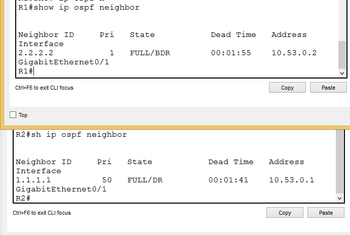
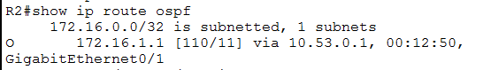
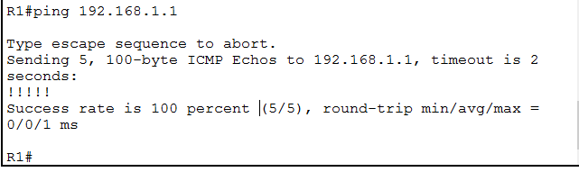
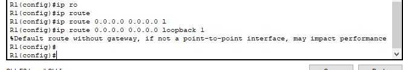
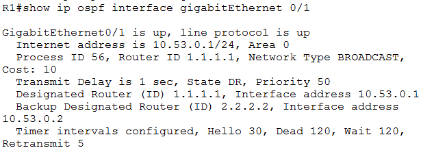
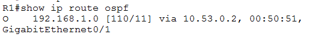
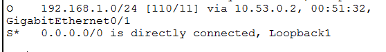
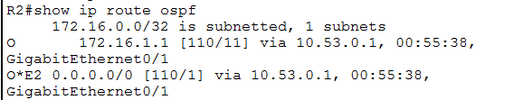
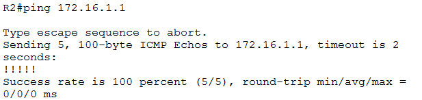

# Лабораторная работа. Настройка протокола OSPFv2 для одной области

## Топология


## Таблица адресации


## Цели

## Часть 1. Создание сети и настройка основных параметров устройства

## Часть 2. Настройка и проверка базовой работы протокола  OSPFv2 для одной области

## Часть 3. Оптимизация и проверка конфигурации OSPFv2 для одной области

## __________________________________________________

## Ход работы

## Часть 1. Создание сети и настройка основных параметров устройства

### Шаг 1. Создайте сеть согласно топологии.

**Подключите устройства, как показано в топологии, и подсоедините необходимые кабели.**

### Шаг 2. Произведите базовую настройку маршрутизаторов.

**a.	Назначьте маршрутизатору имя устройства.**
```
hostname R1
```
**b.	Отключите поиск DNS, чтобы предотвратить попытки маршрутизатора неверно преобразовывать введенные команды 
таким образом, как будто они являются именами узлов.**
```
no ip domain-lookup
```
**c.	Назначьте cisco в качестве зашифрованного пароля привилегированного режима EXEC.**
```
enable secret 5 $1$mERr$hx5rVt7rPNoS4wqbXKX7m0
```
**d.	Назначьте cisco в качестве пароля консоли и включите вход в систему по паролю.**
```
line con 0
 login local
```
**e.	Назначьте cisco в качестве пароля VTY и включите вход в систему по паролю.**
```
line vty 0 4
 login local
 transport input ssh
```
**f.	Зашифруйте открытые пароли.**
```
service password-encryption
```
**g.	Создайте баннер с предупреждением о запрете несанкционированного доступа к устройству.**
```
banner motd ^C
*****************STOP!!!*******************^C
```
**h.	Сохраните текущую конфигурацию в файл загрузочной конфигурации.**
```
R1#copy running-config startup-config 
```
### Шаг 3. Настройте базовые параметры каждого коммутатора.

**a.	Назначьте коммутатору имя устройства.**
```
hostname S1
```
**b.	Отключите поиск DNS, чтобы предотвратить попытки маршрутизатора неверно преобразовывать введенные команды таким образом, как будто они являются именами узлов.**
```
no ip domain-lookup
```
**c.	Назначьте cisco в качестве зашифрованного пароля привилегированного режима EXEC.**
```
enable secret 5 $1$mERr$hx5rVt7rPNoS4wqbXKX7m0
```
**d.	Назначьте cisco в качестве пароля консоли и включите вход в систему по паролю.**
```
line con 0
 login local
```
**e.	Назначьте cisco в качестве пароля VTY и включите вход в систему по паролю.**
```
line vty 0 4
 login local
 transport input ssh
```
**f.	Зашифруйте открытые пароли.**
```
no service password-encryption
```
**g.	Создайте баннер с предупреждением о запрете несанкционированного доступа к устройству.**
```
banner motd ^C
*****************STOP!!!*******************^C
```
**h.	Сохраните текущую конфигурацию в файл загрузочной конфигурации.**
```
S1#copy running-config startup-config 
```

## Часть 2. Настройка и проверка базовой работы протокола OSPFv2 для одной области

### Шаг 1. Настройте адреса интерфейса и базового OSPFv2 на каждом маршрутизаторе.

**a.	Настройте адреса интерфейсов на каждом маршрутизаторе, как показано в таблице адресации выше.**
```
interface GigabitEthernet0/1
 ip address 10.53.0.1 255.255.255.0

interface Loopback1
 ip address 172.16.1.1 255.255.255.0
```
**b.	Перейдите в режим конфигурации маршрутизатора OSPF, используя идентификатор процесса 56.**
```
router ospf 56
```
**c.	Настройте статический идентификатор маршрутизатора для каждого маршрутизатора (1.1.1.1 для R1, 2.2.2.2 для R2).**
```
R1:
router ospf 56
 router-id 1.1.1.1

R2:
router ospf 56
 router-id 2.2.2.2
```
**d.	Настройте инструкцию сети для сети между R1 и R2, поместив ее в область 0.**
```
R1:
interface GigabitEthernet0/1
ip address 10.53.0.1 255.255.255.0
 ip ospf 56 area 0
R2:
interface GigabitEthernet0/1
 ip address 10.53.0.2 255.255.255.0
  ip ospf 56 area 0
```
**e.	Только на R2 добавьте конфигурацию, необходимую для объявления сети Loopback 1 в область OSPF 0.**
```
interface Loopback1
 ip address 192.168.1.1 255.255.255.0
 ip ospf 56 area 0
```
**f.	Убедитесь, что OSPFv2 работает между маршрутизаторами. Выполните команду, чтобы убедиться, что R1 и R2 сформировали смежность.**



**Вопрос:**

**Какой маршрутизатор является DR? Какой маршрутизатор является BDR? Каковы критерии отбора?**

**Ответ:**
***2.2.2.2 - с наивысшем ID***

**g.	На R1 выполните команду show ip route ospf, чтобы убедиться, что сеть R2 Loopback1 присутствует**

**в таблице маршрутизации. Обратите внимание, что поведение OSPF по умолчанию заключается в объявлении интерфейса**

**обратной связи в качестве маршрута узла с использованием 32-битной маски.**



**h.	Запустите Ping до  адреса интерфейса R2 Loopback 1 из R1. Выполнение команды ping должно быть успешным.**



## Часть 3. Оптимизация и проверка конфигурации OSPFv2 для одной области

### Шаг 1. Реализация различных оптимизаций на каждом маршрутизаторе.

**a.	На R1 настройте приоритет OSPF интерфейса G0/0/1 на 50, чтобы убедиться, что R1 является назначенным маршрутизатором.**
```
interface GigabitEthernet0/1
  ip ospf priority 50
```
**b.	Настройте таймеры OSPF на G0/0/1 каждого маршрутизатора для таймера приветствия, составляющего 30 секунд.**
```
interface GigabitEthernet0/1
 ip ospf hello-interval 30
 ip ospf dead-interval 120
```
**c.	На R1 настройте статический маршрут по умолчанию, который использует интерфейс Loopback 1 в качестве интерфейса выхода. Затем распространите**
**маршрут по умолчанию в OSPF. Обратите внимание на сообщение консоли после установки маршрута по умолчанию.**
```
ip route 0.0.0.0 0.0.0.0 Loopback1
!
router ospf 56
 router-id 1.1.1.1
 log-adjacency-changes
 default-information originate
```




**d.	добавьте конфигурацию, необходимую для OSPF для обработки R2 Loopback 1 как сети точка-точка.**
**Это приводит к тому, что OSPF объявляет Loopback 1 использует маску подсети интерфейса.**
```
interface Loopback1
 ip address 192.168.1.1 255.255.255.0
 ip ospf network point-to-point
```
**e.	Только на R2 добавьте конфигурацию, необходимую для предотвращения отправки объявлений OSPF в сеть Loopback 1.**
```
router ospf 56
 router-id 2.2.2.2
 log-adjacency-changes
 passive-interface Loopback1
```
**f.	Измените базовую пропускную способность для маршрутизаторов. После этой настройки перезапустите** 
**OSPF с помощью команды clear ip ospf process**
```
R2#sh ip ospf interface gigabitEthernet 0/1

GigabitEthernet0/1 is up, line protocol is up
  Internet address is 10.53.0.2/24, Area 0
  Process ID 56, Router ID 2.2.2.2, Network Type BROADCAST, Cost: 10
```
### Шаг 2. Убедитесь, что оптимизация OSPFv2 реализовалась.

**a.	Выполните команду show ip ospf interface g0/0/1 на R1 и убедитесь, что приоритет интерфейса установлен равным 50, а временные интервалы — Hello 30, Dead 120, а тип сети по умолчанию — Broadcast**



**b.	На R1 выполните команду show ip route ospf, чтобы убедиться, что сеть R2 Loopback1 присутствует в таблице маршрутизации. Обратите внимание на разницу в метрике между этим выходным и предыдущим выходным. Также обратите внимание, что маска теперь составляет 24 бита, в отличие от 32 битов, ранее объявленных.**





**c.	Введите команду show ip route ospf на маршрутизаторе R2. Единственная информация о маршруте OSPF должна быть распространяемый по умолчанию маршрут R1.**



**d.	Запустите Ping до адреса интерфейса R1 Loopback 1 из R2. Выполнение команды ping должно быть успешным.**



**Вопрос:
Почему стоимость OSPF для маршрута по умолчанию отличается от стоимости OSPF в R1 для сети 192.168.1.0/24?**

**Ответ:
Сеть 192.168.1.0/24 подключена непосредственно к R2. Поэтому стоимость для R2 меньше.**

**Конфигурации R1 и R2:**
```
R1#sh r
Building configuration...

Current configuration : 1288 bytes
!
version 15.1
no service timestamps log datetime msec
no service timestamps debug datetime msec
service password-encryption
!
hostname R1
!
!
!
enable secret 5 $1$mERr$hx5rVt7rPNoS4wqbXKX7m0
!
!
!
!
!
!
ip cef
no ipv6 cef
!
!
!
username admin privilege 15 secret 5 $1$mERr$hx5rVt7rPNoS4wqbXKX7m0
!
!
license udi pid CISCO2911/K9 sn FTX152496TM-
!
!
!
!
!
!
!
!
!
ip ssh version 2
no ip domain-lookup
ip domain-name otus.ru
!
!
spanning-tree mode pvst
!
!
!
!
!
!
interface Loopback1
 ip address 172.16.1.1 255.255.255.0
 ip ospf 56 area 0
!
interface GigabitEthernet0/0
 no ip address
 duplex auto
 speed auto
 shutdown
!
interface GigabitEthernet0/1
 ip address 10.53.0.1 255.255.255.0
 ip ospf cost 10
 ip ospf hello-interval 30
 ip ospf dead-interval 120
 ip ospf priority 50
 ip ospf 56 area 0
 duplex auto
 speed auto
!
interface GigabitEthernet0/2
 no ip address
 duplex auto
 speed auto
 shutdown
!
interface Vlan1
 no ip address
 shutdown
!
router ospf 56
 router-id 1.1.1.1
 log-adjacency-changes
 default-information originate
!
ip classless
ip route 0.0.0.0 0.0.0.0 Loopback1 
!
ip flow-export version 9
!
!
!
banner motd ^C
*****************STOP!!!*******************^C
!
!
!
!
!
line con 0
 login local
!
line aux 0
!
line vty 0 4
 login local
 transport input ssh
!
!
!
end
```
```
R2#show running-config 
Building configuration...

Current configuration : 1282 bytes
!
version 15.1
no service timestamps log datetime msec
no service timestamps debug datetime msec
service password-encryption
!
hostname R2
!
!
!
enable secret 5 $1$mERr$hx5rVt7rPNoS4wqbXKX7m0
!
!
!
!
!
!
ip cef
no ipv6 cef
!
!
!
username admin privilege 15 secret 5 $1$mERr$hx5rVt7rPNoS4wqbXKX7m0
!
!
license udi pid CISCO2911/K9 sn FTX1524J936-
!
!
!
!
!
!
!
!
!
ip ssh version 2
no ip domain-lookup
ip domain-name otus.ru
!
!
spanning-tree mode pvst
!
!
!
!
!
!
interface Loopback1
 ip address 192.168.1.1 255.255.255.0
 ip ospf network point-to-point
 ip ospf priority 1
 ip ospf 56 area 0
!
interface GigabitEthernet0/0
 no ip address
 duplex auto
 speed auto
 shutdown
!
interface GigabitEthernet0/1
 ip address 10.53.0.2 255.255.255.0
 ip ospf cost 10
 ip ospf hello-interval 30
 ip ospf dead-interval 120
 ip ospf 56 area 0
 duplex auto
 speed auto
!
interface GigabitEthernet0/2
 no ip address
 duplex auto
 speed auto
 shutdown
!
interface Vlan1
 no ip address
 shutdown
!
router ospf 56
 router-id 2.2.2.2
 log-adjacency-changes
 passive-interface Loopback1
!
ip classless
!
ip flow-export version 9
!
!
!
banner motd ^C
*****************STOP!!!*******************^C
!
!
!
!
!
line con 0
 login local
!
line aux 0
!
line vty 0 4
 login local
 transport input ssh
!
!
!
end
```


