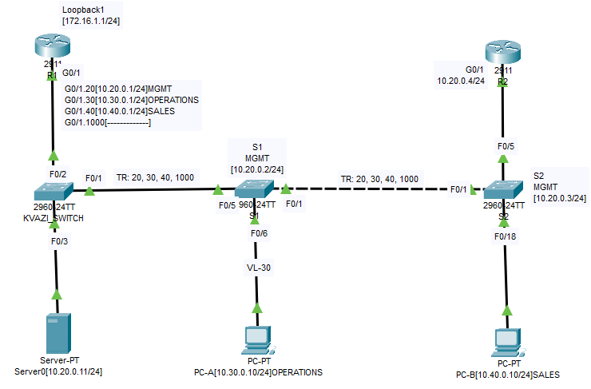
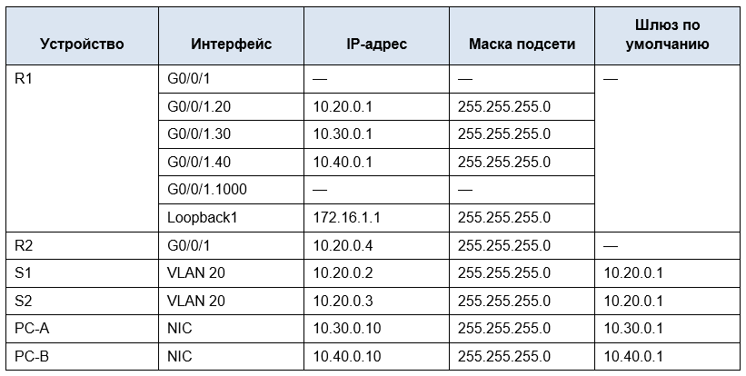

# Лабораторная работа. Настройка и проверка расширенных списков контроля доступа.
## Топология

## Таблица адресации

## Таблица VLAN

|    VLAN          |  NAME          |   Назначенный интерфейс                                           |
|-----------------:|:---------------|------------------------------------------------------------------:|
|      20          |     Management | S2: F0/5                                                          | 
|      30          |     Operations | S1: F0/6                                                          |
|       40         |    Sales       | S2: F0/18                                                         |
|      999         |   ParkingLot   | S1: F0/2-4, F0/7-24, G0/1-2 S2: F0/2-4, F0/6-17, F0/19-24, G0/1-2 |
|        1000      |  Собственная   |                                                                   |

