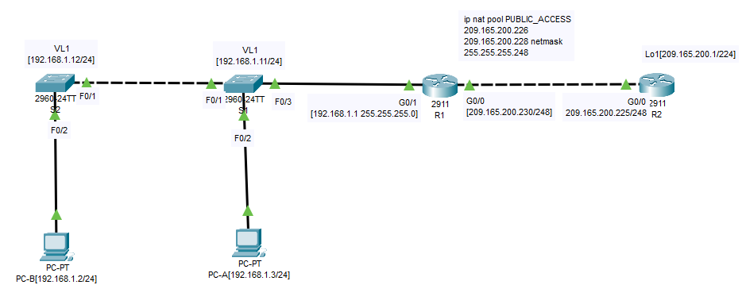
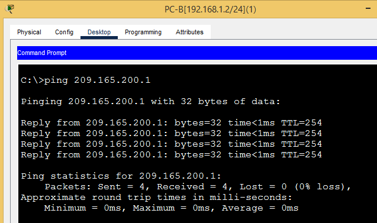

# Лабораторная работа - Настройка NAT для IPv4

## Топология




## Цели
## Часть 1. Создание сети и настройка основных параметров устройства
## Часть 2. Настройка и проверка NAT для IPv4
## Часть 3. Настройка и проверка PAT для IPv4
## Часть 4. Настройка и проверка статического NAT для IPv4.

## ________________________________________________________________________________________________
## Ход работы

## Часть 1. Создание сети и настройка основных параметров устройства

### Шаг 1. Подключите кабели сети согласно приведенной топологии.

**Подключите устройства в соответствии с топологией и подсоедините соответствующие кабели.**

***Схема собрана.***

### Шаг 2. Произведите базовую настройку маршрутизаторов.

**a.	Назначьте маршрутизатору имя устройства.**
```
hostname R1
```
**b.	Отключите поиск DNS, чтобы предотвратить попытки маршрутизатора неверно преобразовывать введенные команды таким образом, как будто они являются именами узлов.**
```
no ip domain-lookup
```
**c.	Назначьте class в качестве зашифрованного пароля привилегированного режима EXEC.**
```
enable secret 5 $1$mERr$hx5rVt7rPNoS4wqbXKX7m0
```
**d.	Назначьте cisco в качестве пароля консоли и включите вход в систему по паролю.**
```
line con 0
 exec-timeout 60 0
 password cisco
```
**e.	Назначьте cisco в качестве пароля VTY и включите вход в систему по паролю.**
```
line vty 0 4
 login local
```
**f.	Зашифруйте открытые пароли.**
```
service password-encryption
```
**g.	Создайте баннер с предупреждением о запрете несанкционированного доступа к устройству.**
```
banner motd ^C
***************STOP!!!******************^C
```
**h.	Настройте IP-адресации интерфейса, как указано в таблице выше.**
```
R2:
interface Loopback1
 ip address 209.165.200.1 255.255.255.224
!
interface GigabitEthernet0/0
 ip address 209.165.200.225 255.255.255.248
 duplex auto
 speed auto
!
R1:
interface GigabitEthernet0/0
 ip address 209.165.200.230 255.255.255.248
 ip nat outside
 duplex auto
 speed auto
!
interface GigabitEthernet0/1
 ip address 192.168.1.1 255.255.255.0
 ip nat inside
 duplex auto
 speed auto
```
**i.	Настройте маршрут по умолчанию. от R2 до  R1.**
```
R2(config)#ip route 0.0.0.0 0.0.0.0 209.165.200.230
```
**j.	Сохраните текущую конфигурацию в файл загрузочной конфигурации.**
```
R1#copy running-config startup-config 
```
### Шаг 3. Настройте базовые параметры каждого коммутатора.

**a.	Присвойте коммутатору имя устройства.**
```
hostname S1
```
**b.	Отключите поиск DNS, чтобы предотвратить попытки маршрутизатора неверно преобразовывать введенные команды таким образом, как будто они являются именами узлов.**
```
ip domain-name otus.ru
```
**c.	Назначьте cisco в качестве зашифрованного пароля привилегированного режима EXEC.**
```
enable secret 5 $1$mERr$hx5rVt7rPNoS4wqbXKX7m0
```
**d.	Назначьте cisco в качестве пароля консоли и включите вход в систему по паролю.**
```
enable secret 5 $1$mERr$hx5rVt7rPNoS4wqbXKX7m0

```
**e.	Назначьте cisco в качестве пароля VTY и включите вход в систему по паролю.**
```
line con 0
 password 7 0822455D0A16
```
**f.	Зашифруйте открытые пароли.**
```
service password-encryption
```
**g.	Создайте баннер с предупреждением о запрете несанкционированного доступа к устройству.**
```
banner motd ^C
************STOP!!!*************^C
```
**h.	Выключите все интерфейсы, которые не будут использоваться.**
```
S1:
interface range fastEthernet 0/4-24, gigabitEthernet 0/1-2
!
S2:
interface range fastEthernet 0/3-24, gigabitEthernet 0/1-2
```
**i.	Настройте IP-адресации интерфейса, как указано в таблице выше.**
```
S1:
interface Vlan1
 ip address 192.168.1.11 255.255.255.0
!
S2:
interface Vlan1
 ip address 192.168.1.12 255.255.255.0
```
**j.	Сохраните текущую конфигурацию в файл загрузочной конфигурации.**
```
S1#copy running-config startup-config
```
## Часть 2. Настройка и проверка NAT для IPv4.

**В части 2 необходимо настроить и проверить NAT для IPv4.**

### Шаг 1. Настройте NAT на R1, используя пул из трех адресов 209.165.200.226-209.165.200.228. 

**a.	Настройте простой список доступа, который определяет, какие хосты будут разрешены для трансляции.**
**В этом случае все устройства в локальной сети R1 имеют право на трансляцию.**

```
R1(config)# access-list 1 permit 192.168.1.0 0.0.0.255 
```
**b.	Создайте пул NAT и укажите ему имя и диапазон используемых адресов.**
```
R1(config)# ip nat pool PUBLIC_ACCESS 209.165.200.226 209.165.200.228 netmask 255.255.255.248 
```
**c.	Настройте перевод, связывая ACL и пул с процессом преобразования.**
```
R1(config)# ip nat inside source list 1 pool PUBLIC_ACCESS 
```
**d.	Задайте внутренний (inside) интерфейс.**
```
R1(config)# interface g0/0/1
R1(config-if)# ip nat inside
```
**e.	Определите внешний (outside) интерфейс.**
```
R1(config)# interface g0/0/0
R1(config-if)# ip nat outside
```
### Шаг 2. Проверьте и проверьте конфигурацию. 
**a.	С PC-B,  запустите эхо-запрос интерфейса Lo1 (209.165.200.1) на R2.**

**Если эхо-запрос не прошел, выполните процес поиска и устранения неполадок.**

**На R1 отобразите таблицу NAT на R1 с помощью команды show ip nat translations.**
```
R1# show ip nat translations
```


**Во что был транслирован внутренний локальный адрес PC-B?**

 
**Какой тип адреса NAT является переведенным адресом?**


