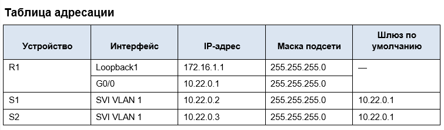

# Лабораторная работа - Настройка протоколов CDP, LLDP и NTP
## Топология




## Часть 1. Создание сети и настройка основных параметров устройства

### Шаг 1. Создайте сеть согласно топологии.

**Подключите устройства, как показано в топологии, и подсоедините необходимые кабели.**

***Устройства подключены согласно топологии***

### Шаг 2. Настройте базовые параметры для маршрутизатора.

**a.	Назначьте маршрутизатору имя устройства.**
```
hostname R1
```
**b.	Отключите поиск DNS, чтобы предотвратить попытки маршрутизатора неверно преобразовывать введенные команды таким образом, как будто они являются именами узлов.**
```
no ip domain-lookup
```
**c.	Назначьте cisco в качестве зашифрованного пароля привилегированного режима EXEC.**
```
enable secret 5 $1$mERr$hx5rVt7rPNoS4wqbXKX7m0
```
**d.	Назначьте cisco в качестве пароля консоли и включите вход в систему по паролю.**
```
line con 0
 exec-timeout 60 0
 password 7 0822455D0A16
 logging synchronous
```
**e.	Назначьте cisco в качестве пароля VTY и включите вход в систему по паролю.**
```
line vty 0 4
 login local
 transport input ssh
```
**f.	Зашифруйте открытые пароли.**
```
service password-encryption
```
**g.	Создайте баннер с предупреждением о запрете несанкционированного доступа к устройству.**
```
banner motd ^C
***************STOP!!!******************^C
```
**h.	Настройка интерфейсов, перечисленных в таблице выше**
```
interface Loopback1
 ip address 172.16.1.1 255.255.255.0
!
interface GigabitEthernet0/0
 ip address 10.22.0.1 255.255.255.0
 duplex auto
 speed auto
```
**i.	Сохраните текущую конфигурацию в файл загрузочной конфигурации.**
```
R1#copy running-config startup-config 
```
### Шаг 3. Настройте базовые параметры каждого коммутатора.

**a.	Присвойте коммутатору имя устройства.**
```
hostname S1
```
**b.	Отключите поиск DNS, чтобы предотвратить попытки маршрутизатора неверно преобразовывать введенные команды таким образом, как будто они являются именами узлов.**
```
no ip domain-lookup
```
**c.	Назначьте cisco в качестве зашифрованного пароля привилегированного режима EXEC.**
```
username admin secret 5 $1$mERr$hx5rVt7rPNoS4wqbXKX7m0
```
**d.	Назначьте cisco в качестве пароля консоли и включите вход в систему по паролю.**
```
line con 0
 password 7 0822455D0A16
 logging synchronous
 exec-timeout 60 0
```
**e.	Назначьте cisco в качестве пароля VTY и включите вход в систему по паролю.**
```
line vty 0 4
 login local
 transport input ssh
line vty 5 15
 login
```
**f.	Зашифруйте открытые пароли.**
```
service password-encryption
```
**g.	Создайте баннер, который предупреждает всех, кто обращается к устройству, видит баннерное сообщение «Только авторизованные пользователи!».**  
```
banner motd ^C
************STOP!!!*************^C
```
**h.	Отключите неиспользуемые интерфейсы**
```
S1(config)#interface range fastEthernet 0/3-24, gigabitEthernet 0/1-2
S1(config-if-range)#shutdown 
```
**i.	Сохраните текущую конфигурацию в файл загрузочной конфигурации.**
```
S1#copy running-config startup-config 
```

## Часть 2. Обнаружение сетевых ресурсов с помощью протокола CDP

**На устройствах Cisco протокол CDP включен по умолчанию. Воспользуйтесь CDP, чтобы обнаружить порты, к которым подключены кабели.**

**a.	На R1 используйте соответствующую команду show cdp, чтобы определить, сколько интерфейсов включено CDP, сколько из них включено и сколько отключено.**
 ```
S1#sh cdp interface 
FastEthernet0/1 is up, line protocol is up
  Sending CDP packets every 60 seconds
  Holdtime is 180 seconds
FastEthernet0/2 is up, line protocol is up
  Sending CDP packets every 60 seconds
  Holdtime is 180 seconds

S2#show cdp interface 
FastEthernet0/1 is up, line protocol is up
  Sending CDP packets every 60 seconds
  Holdtime is 180 seconds

R1#show cdp interface 
Vlan1 is administratively down, line protocol is down
  Sending CDP packets every 60 seconds
  Holdtime is 180 seconds
GigabitEthernet0/0 is up, line protocol is up
  Sending CDP packets every 60 seconds
```
**Вопрос:**

**Сколько интерфейсов участвует в объявлениях CDP? Какие из них активны?**

***CDP активно на включненных интерфейсах, на которых включено CDP***
 
**b.	На R1 используйте соответствующую команду show cdp, чтобы определить версию IOS, используемую на S1.**
```
R1#show cdp entry  S1

Device ID: S1
Entry address(es): 
  IP address : 10.22.0.2
Platform: cisco 2960, Capabilities: Switch
Interface: GigabitEthernet0/0, Port ID (outgoing port): FastEthernet0/2
Holdtime: 178

Version :
Cisco IOS Software, C2960 Software (C2960-LANBASEK9-M), Version 15.0(2)SE4, RELEASE SOFTWARE (fc1)
Technical Support: http://www.cisco.com/techsupport
Copyright (c) 1986-2013 by Cisco Systems, Inc.
Compiled Wed 26-Jun-13 02:49 by mnguyen

advertisement version: 2
Duplex: full
```
**Вопрос:**

**Какая версия IOS используется на  S1?**

***C2960 Software (C2960-LANBASEK9-M), Version 15.0(2)SE4, RELEASE SOFTWARE (fc1)***
 
**c.	На S1 используйте соответствующую команду show cdp, чтобы определить, сколько пакетов CDP было выданных.**
```
S1# show cdp traffic
CDP counters : 
        Total packets output: 179, Input: 148 
        Hdr syntax: 0, Chksum error: 0, Encaps failed: 0 
        No memory: 0, Invalid packet: 0, 
        CDP version 1 advertisements output: 0, Input: 0 
        CDP version 2 advertisements output: 179, Input: 148
```

**Вопрос:**
**Сколько пакетов имеет выход CDP с момента последнего сброса счетчика?**

***Input: 148***
 
**d.	Настройте SVI для VLAN 1 на S1 и S2, используя IP-адреса, указанные в таблице адресации выше.** 
**Настройте шлюз по умолчанию для каждого коммутатора на основе таблицы адресов.**
```
S1:
interface Vlan1
 ip address 10.22.0.2 255.255.255.0
!
ip default-gateway 10.22.0.1

S2:
interface Vlan1
 ip address 10.22.0.3 255.255.255.0
!
ip default-gateway 10.22.0.1
``` 
**e.	На R1 выполните команду show cdp entry S1.** 
```
R1#  show cdp entry S1

Device ID: S1
Entry address(es): 
  IP address : 10.22.0.2
Platform: cisco 2960, Capabilities: Switch
Interface: GigabitEthernet0/0, Port ID (outgoing port): FastEthernet0/2
Holdtime: 139

Version :
Cisco IOS Software, C2960 Software (C2960-LANBASEK9-M), Version 15.0(2)SE4, RELEASE SOFTWARE (fc1)
Technical Support: http://www.cisco.com/techsupport
Copyright (c) 1986-2013 by Cisco Systems, Inc.
Compiled Wed 26-Jun-13 02:49 by mnguyen

advertisement version: 2
Duplex: full
```
**Вопрос:**

**Какие дополнительные сведения доступны теперь?**

***Device ID,Entry address(es),IP address, Platform: cisco 2960, Capabilities, Switch Interfac, Port ID, Holdtime, Version :***

``` 
R1#  show cdp entry S1

Device ID: S1
Entry address(es): 
  IP address : 10.22.0.2
Platform: cisco 2960, Capabilities: Switch
Interface: GigabitEthernet0/0, Port ID (outgoing port): FastEthernet0/2
Holdtime: 135

Version :
Cisco IOS Software, C2960 Software (C2960-LANBASEK9-M), Version 15.0(2)SE4, RELEASE SOFTWARE (fc1)
Technical Support: http://www.cisco.com/techsupport
Copyright (c) 1986-2013 by Cisco Systems, Inc.
Compiled Wed 26-Jun-13 02:49 by mnguyen

advertisement version: 2
Duplex: full
```

**f.	Отключить CDP глобально на всех устройствах.**
```
R1(config)#no cdp run
R1#sh cdp 
% CDP is not enabled
```
 
## Часть 3. Обнаружение сетевых ресурсов с помощью протокола LLDP

**На устройствах Cisco протокол LLDP может быть включен по умолчанию. Воспользуйтесь LLDP, чтобы обнаружить порты, к которым подключены кабели.**

**a.	Введите соответствующую команду lldp, чтобы включить LLDP на всех устройствах в топологии.**

**b.	На S1 выполните соответствующую команду lldp, чтобы предоставить подробную информацию о S2.**

**S1# show lldp entry S2 (CPT не позволяет выполнить данную комманду. Поэтому выполним "show lldp neighbors" )**
```
S1# show lldp neighbors 

Capability codes:
    (R) Router, (B) Bridge, (T) Telephone, (C) DOCSIS Cable Device
    (W) WLAN Access Point, (P) Repeater, (S) Station, (O) Other
Device ID           Local Intf     Hold-time  Capability      Port ID
S2                  Fa0/1          120        B               Fa0/1
R1                  Fa0/2          120        R               Gig0/0

Total entries displayed: 2
```
***"show lldp neighbors" отобразит соседей и интрефейсы подключения.***

**Вопрос:**

**Что такое chassis ID  для коммутатора S2?**

***Chassis ID это обычно MAC-адрес управляющего интерфейса устройства, его имя или серийный номер***
 
**c.	Соединитесь через консоль на всех устройствах и используйте команды LLDP, необходимые для отображения топологии физической сети только из выходных данных команды show.**
```
R1#show lldp neighbors 
Capability codes:
    (R) Router, (B) Bridge, (T) Telephone, (C) DOCSIS Cable Device
    (W) WLAN Access Point, (P) Repeater, (S) Station, (O) Other
Device ID           Local Intf     Hold-time  Capability      Port ID
S1                  Gig0/0         120        B               Fa0/2

Total entries displayed: 1

S2#sh lldp neighbors 
Capability codes:
    (R) Router, (B) Bridge, (T) Telephone, (C) DOCSIS Cable Device
    (W) WLAN Access Point, (P) Repeater, (S) Station, (O) Other
Device ID           Local Intf     Hold-time  Capability      Port ID
S1                  Fa0/1          120        B               Fa0/1

Total entries displayed: 1

S1#show lldp neighbors 
Capability codes:
    (R) Router, (B) Bridge, (T) Telephone, (C) DOCSIS Cable Device
    (W) WLAN Access Point, (P) Repeater, (S) Station, (O) Other
Device ID           Local Intf     Hold-time  Capability      Port ID
S2                  Fa0/1          120        B               Fa0/1
R1                  Fa0/2          120        R               Gig0/0

Total entries displayed: 2
```
## Часть 4. Настройка NTP

**В части 4 необходимо настроить маршрутизатор R1 в качестве сервера NTP, а маршрутизатор R2 в качестве клиента NTP маршрутизатора R1.**

**Необходимо выполнить синхронизацию времени для Syslog и отладочных функций.**

**Если время не синхронизировано, сложно определить, какое сетевое событие стало причиной данного сообщения.**

### Шаг 1. Выведите на экран текущее время.

**Введите команду show clock для отображения текущего времени на R1.**
**Запишите отображаемые сведения о текущем времени в следующей таблице.**

--------------------+-------------------

**Дата	Время	Часовой пояс	Источник времени**
			
### Шаг 2. Установите время.

С помощью команды clock set установите время на маршрутизаторе R1. Введенное время должно быть в формате UTC. 
 
### Шаг 3. Настройте главный сервер NTP.

Настройте R1 в качестве хозяина NTP с уровнем слоя 4.
 
### Шаг 4. Настройте клиент NTP.

a.	Выполните соответствующую команду на S1 и S2, чтобы просмотреть настроенное время. Запишите текущее время,  в следующей таблице.


