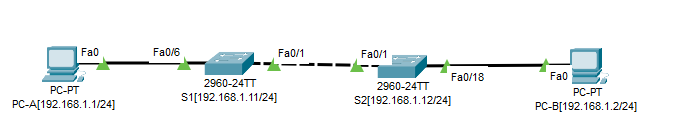

# Лабораторная работа. Просмотр таблицы MAC-адресов коммутатора 
###  Задание:

**1. Часть 1. Создание и настройка сети;**
  
 ##### 1.1. Подключите сеть в соответствии с топологией.
 
 ##### 1.2. Настройте узлы ПК.
 
 ##### 1.3. Выполните инициализацию и перезагрузку коммутаторов.
 
 ##### 1.4. Настройте базовые параметры каждого коммутатора.
 
 ##### Откройте окно конфигурации:
  ##### a.	Настройте имена устройств в соответствии с топологией.
  ##### b.	Настройте IP-адреса, как указано в таблице адресации.
  ##### c.	Назначьте cisco в качестве паролей консоли и VTY.
  ##### d.	Назначьте class в качестве пароля доступа к привилегированному режиму EXEC.

  
**2. Часть 2. Часть 2. Изучение таблицы МАС-адресов коммутатора;**
##### Как только между сетевыми устройствами начинается передача данных, коммутатор выясняет МАС-адреса и строит таблицу

##### 2.1 Запишите МАС-адреса сетевых устройств.;
 ##### a.	Откройте командную строку на PC-A и PC-B и введите команду ipconfig /all.
 ##### Назовите физические адреса адаптера Ethernet.
 ##### MAC-адрес компьютера PC-A:
 ##### MAC-адрес компьютера PC-B:
 ##### b.	Подключитесь к коммутаторам S1 и S2 через консоль и введите команду show interface F0/1 на каждом коммутаторе.
 ##### Откройте окно конфигурации
 ##### Вопросы:
 ##### Назовите адреса оборудования во второй строке выходных данных команды (или зашитый адрес — bia).
 ##### МАС-адрес коммутатора S1 Fast Ethernet 0/1:
 ##### МАС-адрес коммутатора S2 Fast Ethernet 0/1:
 
##### 2.2 Просмотрите таблицу МАС-адресов коммутатора.;
 ##### Подключитесь к коммутатору S2 через консоль и просмотрите таблицу МАС-адресов до и после тестирования сетевой связи с помощью эхо-запросов.
 ##### a.	Подключитесь к коммутатору S2 через консоль и войдите в привилегированный режим EXEC.Откройте окно конфигурации
 ##### b.	В привилегированном режиме EXEC введите команду show mac address-table и нажмите клавишу ввода.

```
S2# show mac address-table
```
 ##### Даже если сетевая коммуникация в сети не происходила (т. е. если команда ping не отправлялась), коммутатор может узнать МАС-адреса при подключении к ПК и другим коммутаторам.
 ##### Вопросы:
 ##### Записаны ли в таблице МАС-адресов какие-либо МАС-адреса?
 ##### Какие МАС-адреса записаны в таблице? С какими портами коммутатора они сопоставлены и каким устройствам принадлежат? Игнорируйте МАС-адреса, сопоставленные с центральным процессором.
 ##### Если вы не записали МАС-адреса сетевых устройств в шаге 1, как можно определить, каким устройствам принадлежат МАС-адреса, используя только выходные данные команды show mac address-table? Работает ли это решение в любой ситуации?

##### 2.3 Очистите таблицу МАС-адресов коммутатора S2 и снова отобразите таблицу МАС-адресов.
 ##### a.	В привилегированном режиме EXEC введите команду clear mac address-table dynamic и нажмите клавишу Enter.
 ```
S2# clear mac address-table dynamic
 ```
 ##### b.	Снова быстро введите команду show mac address-table.
 ##### Вопросы:
 ##### Указаны ли в таблице МАС-адресов адреса для VLAN 1? Указаны ли другие МАС-адреса?
 ##### Через 10 секунд введите команду show mac address-table и нажмите клавишу ввода. Появились ли в таблице МАС-адресов новые адреса?
 
##### 2.4 Шаг 4. С компьютера PC-B отправьте эхо-запросы устройствам в сети и просмотрите таблицу МАС-адресов коммутатора.


    
  ##### 2.2 Настройте IP-адрес для PC;

  **3. Часть 3. Проверка сетевых подключений;**
  
  ##### 3.1 Отобразите конфигурацию устройства.
  
  ##### 3.2 Протестируйте сквозное соединение, отправив эхо-запрос.
    
  ##### 3.3 Протестируйте возможности удаленного управления с помощью Telnet.
###  Решение:
**1. Часть 1.  Проверка конфигурации коммутатора по умолчанию**

* В симуляторе CPT создадим топологию устройств согласно условию работы.



|    Устройство    |   Интерфейс    |   IP-адрес / префикс     |Маска подсети       |
|-----------------:|:---------------|-------------------------:|-------------------:|
|     S1           |     VLAN 1     |   192.168.1.11           | 255.255.255.0      | 
|     S2           |     VLAN 1     |   192.168.1.12           | 255.255.255.0      |
|     PC-A         |     NIC        |   192.168.1.1            | 255.255.255.0      | 
|     PC-B         |     NIC        |   192.168.1.2            | 255.255.255.0      |


* Для первоначальной настройки коммутатора подключимся к нему консольным кабелем. На PC выберем "подключение через терминал", настройки оставим по умолчанию.


* Установим соединение к коммутатору через консоль. 


* Введём в CLI комманду "enable" и далее "show running-config". Получим вывод конфигурации "по умолчанию":

```
Building configuration...

Current configuration : 1080 bytes
!
version 15.0
no service timestamps log datetime msec
no service timestamps debug datetime msec
no service password-encryption
!
hostname Switch
!
!
!
!
!
!
spanning-tree mode pvst
spanning-tree extend system-id
!
interface FastEthernet0/1
!
interface FastEthernet0/2

Switch#sh running-config   
Building configuration...

Current configuration : 1080 bytes
!
version 15.0
no service timestamps log datetime msec
no service timestamps debug datetime msec
no service password-encryption
!
hostname Switch
!
!
!
!
!
!
spanning-tree mode pvst
spanning-tree extend system-id
!
interface FastEthernet0/1
!
interface FastEthernet0/2
!
interface FastEthernet0/3
!
interface FastEthernet0/4
!
interface FastEthernet0/5
!
interface FastEthernet0/6
!
interface FastEthernet0/7
!
interface FastEthernet0/8
!
interface FastEthernet0/9
!
interface FastEthernet0/10
!
interface FastEthernet0/11
!
interface FastEthernet0/12
!
interface FastEthernet0/13
!
interface FastEthernet0/14
!
interface FastEthernet0/15
!
interface FastEthernet0/16
!
interface FastEthernet0/17
!
interface FastEthernet0/18
!
interface FastEthernet0/19
!
interface FastEthernet0/20
!
interface FastEthernet0/21
!
interface FastEthernet0/22
!
interface FastEthernet0/23
!
interface FastEthernet0/24
!
interface GigabitEthernet0/1
!
interface GigabitEthernet0/2
!
interface Vlan1
 no ip address
 shutdown
!
!
!
!
line con 0
!
line vty 0 4
 login
line vty 5 15
 login
!
!
!
!
end
```
**2. Часть 2. Создание сети и настройка основных параметров устройства;**

  #### 2.1. Настройка базовых параметров коммутатора;
  * Введём в CLI комманду "enable" далее "en" и попадём в привелигированный режим. Далее введём "configure terminal" далее "conf t" и попадём в режим глобальной конфигурации.
  * Зададим имя устройства:
  
```
(config)#hostname SW1
```

  * Далее, чтобы при ошибочном вводе комманд коммутатор не искал доменный сервер введём комманду:

```
(config)#no ip domain-lookup
```
  * Установим пароль cisco на консольное соединение:
    
```
(config)#line console 0
(config-line)#password cisco
```
    
Далее включим запрос пароля для доступа по консоли:
 
```
SW1(config-line)#login
    
```
Теперь при подключении через консоль появляется запрос на ввод пароля.
    

  * Закроем паролем досуп для привелигированного режима :

Введём "conf t", затем "enable secret cisco". Параметр secret хранит пароль в конфигурации коммутатора в зашифрованном виде и при попытки зайти в привелигированный режим требуется ввод пароля.

```
SW1(config)#enable secret cisco
```

  * Настроим подключение к коммутатору через сеть посредством протокола Tenlet:

   Введём следующие комманды: 
   
   ```
   (config)#line vty 0 4 - настроим 5 терминальных линий
   (config-line)#transport input telnet - выберем протокол доступа
   (config-line)# password cisco - зададим пароль на вход
   ```

Далее включим шифрование всех паролей на устройстве:

```
service password-encryption
```

Теперь пароли хранятся в зашифрованном виде.

 * Для предупреждения несанкционированного доступа настроим баннер:

 ```
    SW1(config)#banner motd 7
 Enter TEXT message.  End with the character '7'.
 ********************************************
 ###########DO NOT ENTRY#####################
 ********************************************7
 ```

  * Настроим на коммутаторе VLAN и IP адрес для доступа по сети:

    Данная настройка делается из режима глобальной конфигурации.
    Создадим интерфейс VLAN1 и присвоим ему IP адрес. VLAN1 по умолчанию назначен на все интерфейсы коммутатора.
    
 ```
 (config)#interface vlan 1
 (config-if)#ip address  192.168.10.3 255.255.255.0
    
  ```

 Далее сохраним настройки коммутатора в память:

  ```
  #copy startup-config running-config

  ```
Коммутатор настроен.
     
  #### 2.2 Настроим IP-адрес для PC:
  
  

  Необходимые сетевые настройки PC сделаны.
