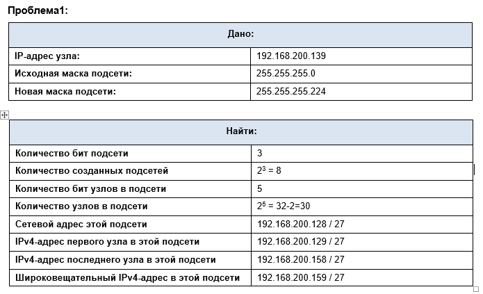
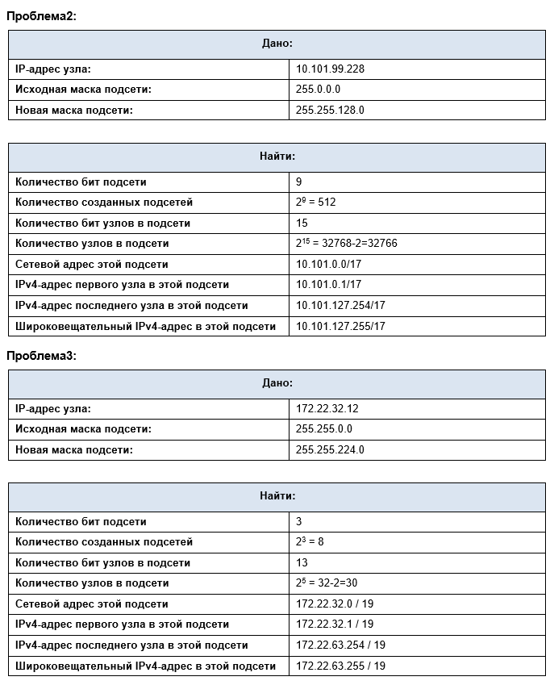
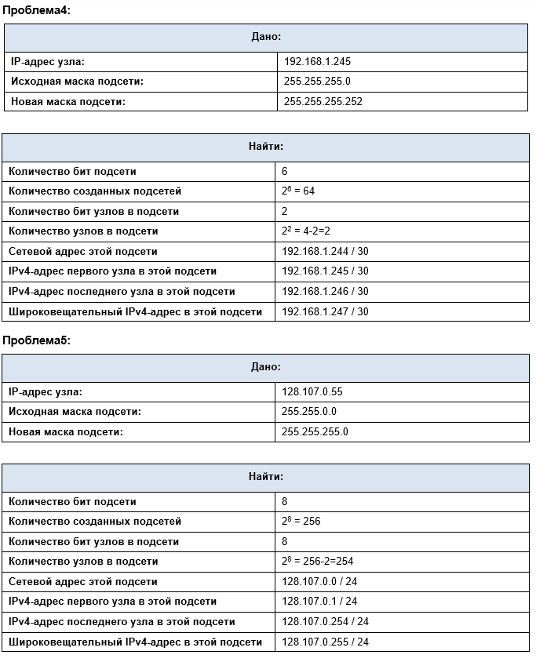
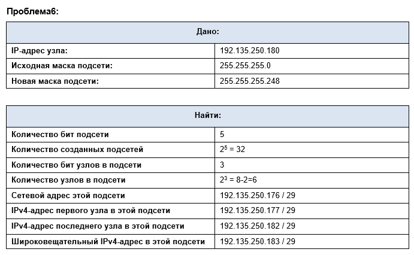

### Лабораторная работа - Расчет подсетей IPv4 

### Задачи
**Часть 1. Определение подсетей по IPv4-адресу**
**Часть 2. Расчет подсетей по IPv4-адресу**

## Инструкции ##
Заполните приведенные ниже таблицы, зная заданный IPv4-адрес, исходную и новую маску подсети

**Вопрос для повторения**
### Почему маска подсети так важна при анализе IPv4-адреса?
**Маска определяет сетевую и хостовую части ip адреса.**
