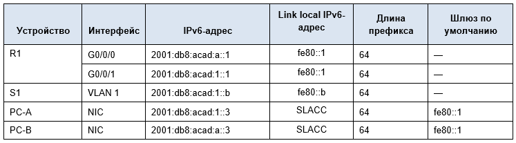
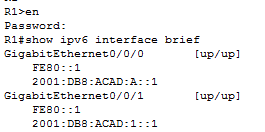
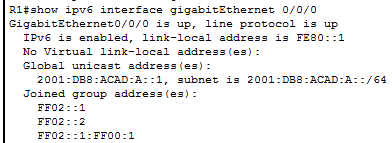
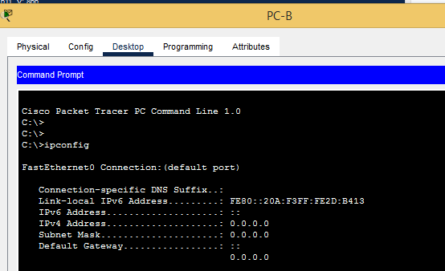
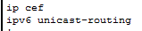
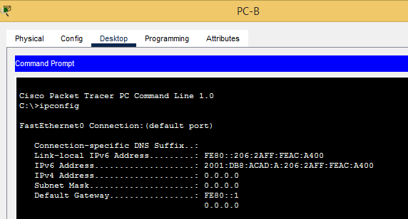
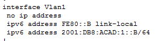
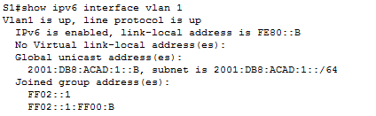
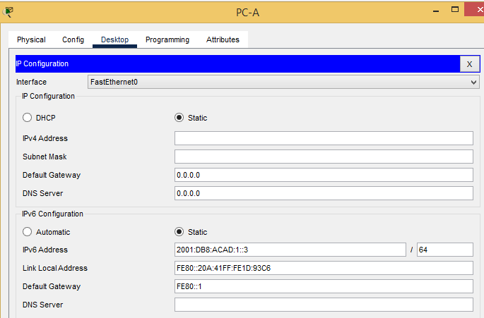
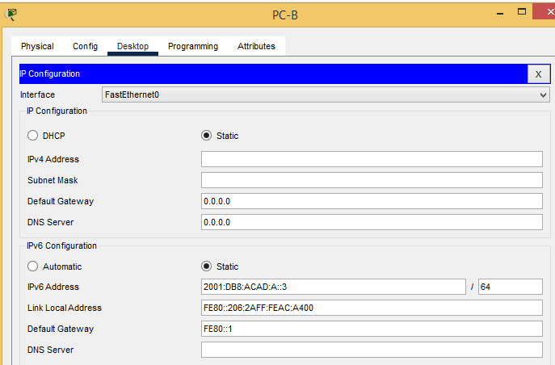

# Лабораторная работа. Настройка IPv6-адресов на сетевых устройствах

**Топология**

 


**Таблица адресации**



**Задачи**

**Часть 1. Настройка топологии и конфигурация основных параметров маршрутизатора и коммутатора**

**Часть 2. Ручная настройка IPv6-адресов**

**Часть 3. Проверка сквозного соединения**

## Ход работы: 

### Часть 1.
### Настройка топологии и конфигурация основных параметров маршрутизатора и коммутатора
*После подключения сети, инициализации и перезагрузки маршрутизатора и коммутатора выполните следующие действия:*

### Шаг 1. Настройте маршрутизатор.

*Назначьте имя хоста и настройте основные параметры устройства.*

Выведем конфигурацию R1 и добавим пояснения:

p.s. - везде задан пароль cisco

```

************************************************
##############STOP!!!###########################
************************************************


User Access Verification

Password: 

R1>en
Password: 
R1#sh run
Building configuration...

Current configuration : 990 bytes
!
version 15.4
no service timestamps log datetime msec
no service timestamps debug datetime msec
service password-encryption
!
hostname R1 - задано имя хоста
!
!
!
enable secret 5 $1$mERr$hx5rVt7rPNoS4wqbXKX7m0 - зашифрованый пароль для входа в привелигерованный режим
!
!
!
!
!
!
ip cef
ipv6 unicast-routing
!
no ipv6 cef
!
!
!
!
!
!
!
!
!
!
!
!
spanning-tree mode pvst
!
!
!
!
!
!
interface GigabitEthernet0/0/0
 no ip address
 duplex auto
 speed auto
 ipv6 address FE80::1 link-local
 ipv6 address 2001:DB8:ACAD:A::1/64
!
interface GigabitEthernet0/0/1
 no ip address
 duplex auto
 speed auto
 ipv6 address FE80::1 link-local
 ipv6 address 2001:DB8:ACAD:1::1/64
!
interface Vlan1
 no ip address
 shutdown
!
ip classless
!
ip flow-export version 9
!
!
!
banner motd ^C - баннер при входе 
************************************************
##############STOP!!!###########################
************************************************
^C
!
!
!
!
!
line con 0 - настройка консольного подключения
 password 7 0822455D0A16
 login
!
line aux 0
!
line vty 0 4 - настройка подключения по telnet
 password 7 0822455D0A16
 login
 transport input telnet
!
!
!
end
```

### Шаг 2. Настройте коммутатор.

*Назначьте имя хоста и настройте основные параметры устройства.*

Выведем конфигурацию S1 

Базовые настройки доступа аналогичны R1

p.s. - везде задан пароль cisco

```
S1>en
Password: 
S1#sh run
Building configuration...

Current configuration : 1410 bytes
!
version 15.0
no service timestamps log datetime msec
no service timestamps debug datetime msec
service password-encryption
!
hostname S1
!
!
enable secret 5 $1$mERr$hx5rVt7rPNoS4wqbXKX7m0
!
!
!
!
!
!
spanning-tree mode pvst
spanning-tree extend system-id
!
interface FastEthernet0/1
!
interface FastEthernet0/2
!
interface FastEthernet0/3
!
interface FastEthernet0/4
!
interface FastEthernet0/5
!
interface FastEthernet0/6
!
interface FastEthernet0/7
!
interface FastEthernet0/8
!
interface FastEthernet0/9
!
interface FastEthernet0/10
!
interface FastEthernet0/11
!
interface FastEthernet0/12
!
interface FastEthernet0/13
!
interface FastEthernet0/14
!
interface FastEthernet0/15
!
interface FastEthernet0/16
!
interface FastEthernet0/17
!
interface FastEthernet0/18
!
interface FastEthernet0/19
!
interface FastEthernet0/20
!
interface FastEthernet0/21
!
interface FastEthernet0/22
!
interface FastEthernet0/23
!
interface FastEthernet0/24
!
interface GigabitEthernet0/1
!
interface GigabitEthernet0/2
!
interface Vlan1
 no ip address
 ipv6 address FE80::B link-local
 ipv6 address 2001:DB8:ACAD:1::B/64
!
banner motd ^C
*******************************************
###############STOP!!!#####################
*******************************************

^C
!
!
!
!
!
line con 0
 password 7 0822455D0A16
 login
!
line vty 0 4
 password 7 0822455D0A16
 login
 transport input telnet
line vty 5 15
 login
!
!
!
!
end
```

### Часть 2. Ручная настройка IPv6-адресов

### Шаг 1. Назначьте IPv6-адреса интерфейсам Ethernet на R1.

*a.	Назначьте глобальные индивидуальные IPv6-адреса, указанные в таблице адресации обоим интерфейсам Ethernet на R1.
Откройте окно конфигурации*

```
interface GigabitEthernet0/0/0 - зайдём на интерфейс R1 из режима глобальной конфигурации
 no ip address
 duplex auto
 speed auto
 ipv6 address FE80::1 link-local - назначим IPv6 канальный адрес 
 ipv6 address 2001:DB8:ACAD:A::1/64 - назначим IPv6 частный адрес
!
interface GigabitEthernet0/0/1 - зайдём на интерфейс R1 из режима глобальной конфигурации
 no ip address
 duplex auto
 speed auto
 ipv6 address FE80::1 link-local - назначим IPv6 канальный адрес 
 ipv6 address 2001:DB8:ACAD:1::1/64 - назначим IPv6 частный адрес
```

*b.	Введите команду show ipv6 interface brief, чтобы проверить, назначен ли каждому интерфейсу корректный индивидуальный IPv6-адрес.*

Представим вырезку из конфигурации R1:



*c.	Чтобы обеспечить соответствие локальных адресов канала индивидуальному адресу, вручную введите локальные адреса канала на каждом интерфейсе Ethernet на R1.*

*d.	Используйте выбранную команду, чтобы убедиться, что локальный адрес связи изменен на fe80::1.*

Вопрос:

Какие группы многоадресной рассылки назначены интерфейсу G0/0?

Ответ: 

FF02::1 - группа многоадресной рассылки для всех узлов

FF02::2 - группа многоадресной рассылки для всех маршрутизаторов



### Шаг 2. Активируйте IPv6-маршрутизацию на R1.

*a.	В командной строке на PC-B введите команду ipconfig, чтобы получить данные IPv6-адреса, назначенного интерфейсу ПК.*

Вопрос:
Назначен ли индивидуальный IPv6-адрес сетевой интерфейсной карте (NIC) на PC-B?



Ответ:

Да. Адрес назначен автоматически

*b.	Активируйте IPv6-маршрутизацию на R1 с помощью команды IPv6 unicast-routing.*



Это позволит компьютерам получать IP-адреса и данные шлюза по умолчанию с помощью функции SLAAC (Stateless Address Autoconfiguration (Автоконфигурация без сохранения состояния адреса)).

*c.	Теперь, когда R1 входит в группу многоадресной рассылки всех маршрутизаторов, еще раз введите команду ipconfig на PC-B. Проверьте данные IPv6-адреса.*



Вопрос:

Почему PC-B получил глобальный префикс маршрутизации и идентификатор подсети, которые вы настроили на R1?

Ответ:
Данные шлюза по умолчанию получены с помощью функции SLAAC (Stateless Address Autoconfiguration (Автоконфигурация без сохранения состояния адреса)).

### Шаг 3. Назначьте IPv6-адреса интерфейсу управления (SVI) на S1.

*a.	Назначьте адрес IPv6 для S1. Также назначьте этому интерфейсу локальный адрес канала fe80::b.*



*b.	Проверьте правильность назначения IPv6-адресов интерфейсу управления с помощью команды show ipv6 interface vlan1.*



### Шаг 4. Назначьте компьютерам статические IPv6-адреса.

*a.	Откройте окно Свойства Ethernet для каждого ПК и назначьте адресацию IPv6.*

*Убедитесь, что оба компьютера имеют правильную информацию адреса IPv6*

PC-A:



PC-B:



### Часть 3. Проверка сквозного подключения

*С PC-A отправьте эхо-запрос на FE80::1. Это локальный адрес канала, назначенный G0/1 на R1.*

13

*Отправьте эхо-запрос на интерфейс управления S1 с PC-A.*

14

*Введите команду tracert на PC-A, чтобы проверить наличие сквозного подключения к PC-B.*

15

*С PC-B отправьте эхо-запрос на PC-A.*

16

*С PC-B отправьте эхо-запрос на локальный адрес канала G0/0 на R1.*

17

*Вопросы для повторения*

1.*Почему обоим интерфейсам Ethernet на R1 можно назначить один и тот же локальный адрес канала — FE80::1?*

2.*Какой идентификатор подсети в индивидуальном IPv6-адресе 2001:db8:acad::aaaa:1234/64?*

