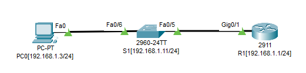
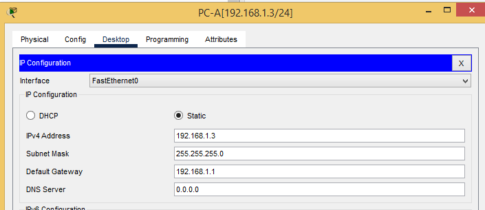
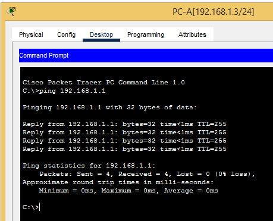

# Лабораторная работа. Доступ к сетевым устройствам по протоколу SSH
## Топология



### Таблица адресации

|    Устройство    |   Интерфейс    |   IP-адрес / префикс     | Шлюз по умолчанию|
|-----------------:|:---------------|-------------------------:|-----------------:|
|      R1          |      G 0/1     | 192.168.1.1/24           |  -               |
|      S1          |      VLAN 1    | 192.168.1.11/24          |   192.168.1.1    |
|      PC-A        |      NIC       | 192.168.1.3/24           |   192.168.1.1    |


### Задачи
### Часть 1. Настройка основных параметров устройства
### Часть 2. Настройка маршрутизатора для доступа по протоколу SSHv2
### Часть 3. Настройка коммутатора для доступа по протоколу SSHv2
### Часть 4. SSH через интерфейс командной строки (CLI) коммутатора
## -------------------------------------------------------------------
## Ход работы


### Часть 1. Настройка основных параметров устройств

В части 1 потребуется настроить топологию сети и основные параметры, такие как IP-адреса 

интерфейсов, доступ к устройствам и пароли на маршрутизаторе.

### Шаг 1. Создайте сеть согласно топологии.
### Шаг 2. Выполните инициализацию и перезагрузку маршрутизатора и коммутатора.
### Шаг 3. Настройте маршрутизатор.

### Откройте окно конфигурации

a.	Подключитесь к маршрутизатору с помощью консоли и активируйте привилегированный режим EXEC.

b.	Войдите в режим конфигурации.

c.	Отключите поиск DNS, чтобы предотвратить попытки маршрутизатора неверно преобразовывать введенные команды таким образом, как будто они являются именами узлов.

d.	Назначьте cisco в качестве зашифрованного пароля привилегированного режима EXEC.

e.	Назначьте cisco в качестве пароля консоли и включите вход в систему по паролю.

f.	Назначьте cisco в качестве пароля VTY и включите вход в систему по паролю.

g.	Зашифруйте открытые пароли.

h.	Создайте баннер, который предупреждает о запрете несанкционированного доступа.

i.	Настройте и активируйте на маршрутизаторе интерфейс G0/0/1, используя информацию, приведенную в таблице адресации.

j.	Сохраните текущую конфигурацию в файл загрузочной конфигурации.

#### Далее представлена конфигурация маршрутизатора R1 с пояснениями, согласно задания.

```
###########################
#########STOP!!!###########
###########################


R1>en
Password: 
R1#conf t - b. Войдём в режим глобальной конфигурации.
Enter configuration commands, one per line.  End with CNTL/Z.
R1(config)#exi
R1#
%SYS-5-CONFIG_I: Configured from console by console

R1#sh run
Building configuration...

Current configuration : 1028 bytes
!
version 15.1
no service timestamps log datetime msec
no service timestamps debug datetime msec
service password-encryption - g.	Зашифруем открытые пароли
!
hostname R1
!
!
!
enable secret 5 $1$mERr$hx5rVt7rPNoS4wqbXKX7m0 - d.	Назначим cisco в качестве зашифрованного пароля привилегированного режима EXEC.
!
!
!
!
!
!
ip cef
no ipv6 cef
!
!
!
username admin privilege 15 secret 5 $1$mERr$hx5rVt7rPNoS4wqbXKX7m0 - Назначим cisco в качестве пароля VTY и включим вход в систему по паролю
!
!
license udi pid CISCO2911/K9 sn FTX1524UK5O-
!
!
!
!
!
!
!
!
!
ip ssh version 2
no ip domain-lookup - c.	Отключим поиск DNS
ip domain-name otus.ru
!
!
spanning-tree mode pvst
!
!
!
!
!
!
interface GigabitEthernet0/0
 no ip address
 duplex auto
 speed auto
 shutdown
!
interface GigabitEthernet0/1 - i.	Настройте и активируйте на маршрутизаторе интерфейс G0/0/1, используя информацию, приведенную в таблице адресации.

 ip address 192.168.1.1 255.255.255.0
 duplex auto
 speed auto
!
interface GigabitEthernet0/2
 no ip address
 duplex auto
 speed auto
 shutdown
!
interface Vlan1
 no ip address
 shutdown
!
ip classless
!
ip flow-export version 9
!
!
!
banner motd ^C - h.	Создадим баннер, который предупреждает о запрете несанкционированного доступа.
###########################
#########STOP!!!###########
###########################
^C
!
!
!
!
!
line con 0
 password 7 0822455D0A16 - e. Назначим cisco в качестве пароля консоли и включите вход в систему по паролю.
!
line aux 0
!
line vty 0 4 
 login local
 transport input ssh
!
!
!
end
!
R1#copy running-config startup-config - j.	Сохраним текущую конфигурацию в файл загрузочной конфигурации.
```
### Шаг 4. Настройте компьютер PC-A.

a.	Настройте для PC-A IP-адрес и маску подсети.

b.	Настройте для PC-A шлюз по умолчанию.



### Шаг 5. Проверьте подключение к сети.

Пошлите с PC-A команду Ping на маршрутизатор R1. Если эхо-запрос с помощью команды ping не проходит, найдите и устраните неполадки подключения




