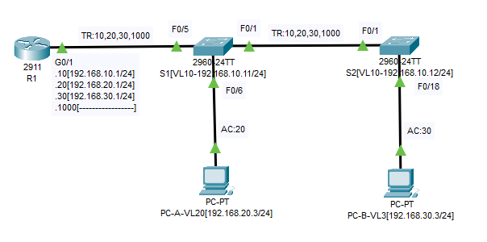
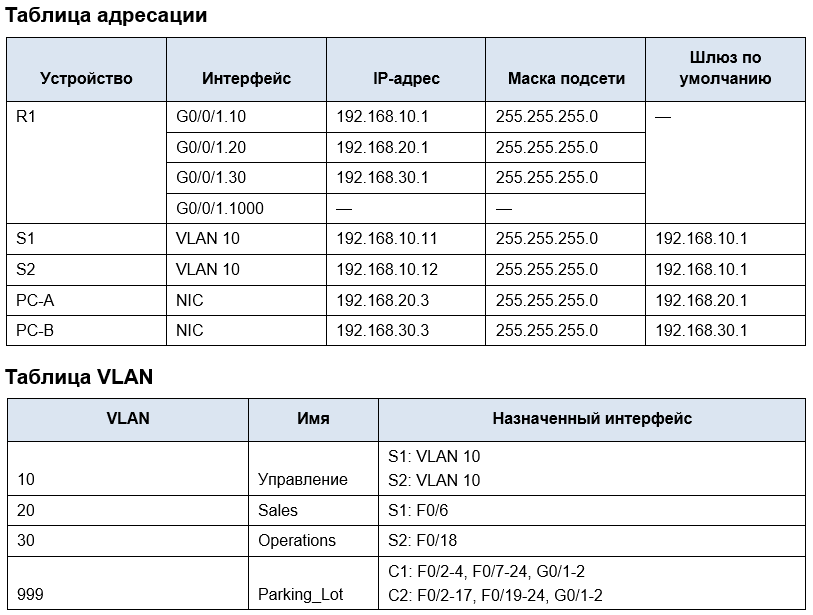
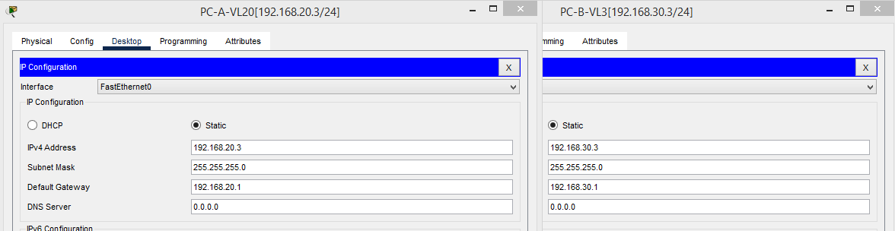
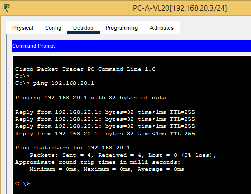
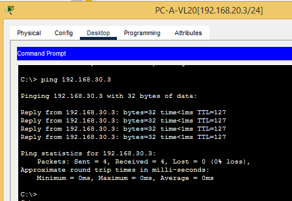
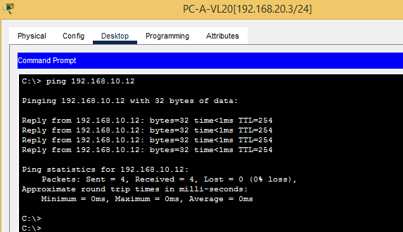
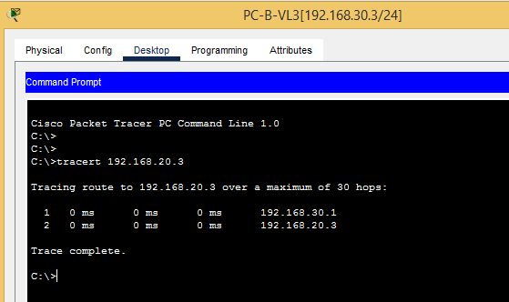

# Лабораторная работа - Внедрение маршрутизации между виртуальными локальными сетями 
## Топология





### Задачи
### Часть 1. Создание сети и настройка основных параметров устройства
### Часть 2. Создание сетей VLAN и назначение портов коммутатора
### Часть 3. Настройка транка 802.1Q между коммутаторами.
### Часть 4. Настройка маршрутизации между сетями VLAN
### Часть 5. Проверка, что маршрутизация между VLAN работает
# ----------------------------------------------------------
## Ход работы

### Часть 1. Создание сети и настройка основных параметров устройства
В первой части лабораторной работы вам предстоит создать топологию сети и настроить базовые параметры для узлов ПК и коммутаторов.

**Шаг 1. Создайте сеть согласно топологии.**

Подключите устройства, как показано в топологии, и подсоедините необходимые кабели.

*Собранная топология представлена на рисунке выше.*

**Шаг 2. Настройте базовые параметры для маршрутизатора.**

a.	Подключитесь к маршрутизатору с помощью консоли и активируйте привилегированный режим EXEC.
Откройте окно конфигурации

b.	Войдите в режим конфигурации.

```
R1>en
```

c.	Назначьте маршрутизатору имя устройства.

```
hostname R1
```

d.	Отключите поиск DNS, чтобы предотвратить попытки маршрутизатора неверно преобразовывать введенные команды таким образом, как будто они являются именами узлов.

```
no ip domain-lookup
```

e.	Назначьте cisco в качестве зашифрованного пароля привилегированного режима EXEC.

```
enable secret 5 $1$mERr$hx5rVt7rPNoS4wqbXKX7m0
```

f.	Назначьте cisco в качестве пароля консоли и включите вход в систему по паролю.

```
line con 0
 password 7 0822455D0A16
 login
```

g.	Установите cisco в качестве пароля виртуального терминала и активируйте вход.

```
line vty 0 4
 login local
 transport input ssh
```

h.	Зашифруйте открытые пароли.

```
service password-encryption
```

i.	Создайте баннер с предупреждением о запрете несанкционированного доступа к устройству.

```
banner motd ^C
!!!!!!!!!!!!!!!!!STOP!!!!!!!!!!!!!!!!!!

^C
```

j.	Сохраните текущую конфигурацию в файл загрузочной конфигурации.

```
R1#copy running-config startup-config 
```

k.	Настройте на маршрутизаторе время.

```
R1#clock set 19:10:00 28 jan 2026
R1#show clock 
22:10:2.503 msk Wed Jan 28 2026
```

Закройте окно настройки.

**Шаг 3. Настройте базовые параметры каждого коммутатора.**

a.	Присвойте коммутатору имя устройства.

```
hostname S1
```

b.	Отключите поиск DNS, чтобы предотвратить попытки маршрутизатора неверно преобразовывать введенные команды таким образом, как будто они являются именами узлов.

```
no ip domain-lookup
```

c.	Назначьте cisco в качестве зашифрованного пароля привилегированного режима EXEC.

```
enable secret 5 $1$mERr$hx5rVt7rPNoS4wqbXKX7m0
```

d.	Назначьте cisco в качестве пароля консоли и включите вход в систему по паролю.

```

line con 0
 password 7 0822455D0A16
 login
```

e.	Установите cisco в качестве пароля виртуального терминала и активируйте вход.

```
username admin secret 5 $1$mERr$hx5rVt7rPNoS4wqbXKX7m0
!
line vty 0 4
 login local
 transport input ssh
```

f.	Зашифруйте открытые пароли.

```
service password-encryption
```

g.	Создайте баннер с предупреждением о запрете несанкционированного доступа к устройству.

```
banner motd ^C
!!!!!!!!!!!!!!!!!STOP!!!!!!!!!!!!!!!!!^C
```

h.	Настройте на коммутаторах время.

```
S1#clock set 19:15:00 28 jan 2026
S1#sh
S1#show cl
S1#show clock 
19:15:4.121 UTC Wed Jan 28 2026
```

i.	Сохранение текущей конфигурации в качестве начальной.

```
S1#copy running-config startup-config 
```

Закройте окно настройки.

**Шаг 4. Настройте узлы ПК.**

Адреса ПК можно посмотреть в таблице адресации.



### Часть 2. Создание сетей VLAN и назначение портов коммутатора
Во второй части вы создадите VLAN, как указано в таблице выше, на обоих коммутаторах. Затем вы назначите VLAN соответствующему интерфейсу и проверите настройки конфигурации. Выполните следующие задачи на каждом коммутаторе.

**Шаг 1. Создайте сети VLAN на коммутаторах.**

a.	Создайте и назовите необходимые VLAN на каждом коммутаторе из таблицы выше.

S1:

```
S2#sh vlan brief

VLAN Name                             Status    Ports
---- -------------------------------- --------- -------------------------------
1    default                          active    Fa0/2, Fa0/3, Fa0/4, Fa0/7
                                                Fa0/8, Fa0/9, Fa0/10, Fa0/11
                                                Fa0/12, Fa0/13, Fa0/14, Fa0/15
                                                Fa0/16, Fa0/17, Fa0/18, Fa0/19
                                                Fa0/20, Fa0/21, Fa0/22, Fa0/23
                                                Fa0/24, Gig0/1, Gig0/2
10   MGMT                             active    
20   Sales                            active    Fa0/6
30   Operations                       active    
```

S2:

```
S2#sh vlan brief 

VLAN Name                             Status    Ports
---- -------------------------------- --------- -------------------------------
1    default                          active    Fa0/2, Fa0/3, Fa0/4, Fa0/5
                                                Fa0/6, Fa0/7, Fa0/8, Fa0/9
                                                Fa0/10, Fa0/11, Fa0/12, Fa0/13
                                                Fa0/14, Fa0/15, Fa0/16, Fa0/17
                                                Fa0/19, Fa0/20, Fa0/21, Fa0/22
                                                Fa0/23, Fa0/24, Gig0/1, Gig0/2
10   MGMT                             active    
30   Operations                       active    Fa0/18
```

b.	Настройте интерфейс управления и шлюз по умолчанию на каждом коммутаторе, используя информацию об IP-адресе в таблице адресации. 

S1

```
interface Vlan10
 ip address 192.168.10.11 255.255.255.0
!
ip default-gateway 192.168.10.1
```

S2

```
interface Vlan10
 ip address 192.168.10.12 255.255.255.0
!
ip default-gateway 192.168.10.1
```

c.	Назначьте все неиспользуемые порты коммутатора VLAN Parking_Lot, настройте их для статического режима доступа и административно деактивируйте их.

```
interface FastEthernet0/2
 description VLAN Parking_Lot
 shutdown
```
*и так на S1 и S2 для каждого неиспользуемого интерфейса. Можно использовать range.*

Примечание. Команда interface range полезна для выполнения этой задачи с минимальным количеством команд.

**Шаг 2. Назначьте сети VLAN соответствующим интерфейсам коммутатора.**

a.	Назначьте используемые порты соответствующей VLAN (указанной в таблице VLAN выше) и настройте их для режима статического доступа.

S1
```
interface FastEthernet0/6
 switchport access vlan 20
 switchport mode access
```
S2
```
interface FastEthernet0/18
 switchport access vlan 30
 switchport mode access
```

b.	Убедитесь, что VLAN назначены на правильные интерфейсы.

S1
```
S1#sh vlan brief 

VLAN Name                             Status    Ports
---- -------------------------------- --------- -------------------------------
1    default                          active    Fa0/2, Fa0/3, Fa0/4, Fa0/7
                                                Fa0/8, Fa0/9, Fa0/10, Fa0/11
                                                Fa0/12, Fa0/13, Fa0/14, Fa0/15
                                                Fa0/16, Fa0/17, Fa0/18, Fa0/19
                                                Fa0/20, Fa0/21, Fa0/22, Fa0/23
                                                Fa0/24, Gig0/1, Gig0/2
10   MGMT                             active    
20   Sales                            active    Fa0/6
30   Operations                       active    
```

S2
```
S2#sh vlan brief 

VLAN Name                             Status    Ports
---- -------------------------------- --------- -------------------------------
1    default                          active    Fa0/2, Fa0/3, Fa0/4, Fa0/5
                                                Fa0/6, Fa0/7, Fa0/8, Fa0/9
                                                Fa0/10, Fa0/11, Fa0/12, Fa0/13
                                                Fa0/14, Fa0/15, Fa0/16, Fa0/17
                                                Fa0/19, Fa0/20, Fa0/21, Fa0/22
                                                Fa0/23, Fa0/24, Gig0/1, Gig0/2
10   MGMT                             active    
30   Operations                       active    Fa0/18
```

### Часть 3. Конфигурация магистрального канала стандарта 802.1Q между коммутаторами
В части 3 вы вручную настроите интерфейс F0/1 как транк.

**Шаг 1. Вручную настройте магистральный интерфейс F0/1 на коммутаторах S1 и S2.**

a.	Настройка статического транкинга на интерфейсе F0/1 для обоих коммутаторов.

S1
```
interface FastEthernet0/1
 switchport trunk native vlan 1000
 switchport trunk allowed vlan 10,20,30,1000
 switchport mode trunk
 switchport nonegotiate

!
interface FastEthernet0/5
 switchport trunk native vlan 1000
 switchport trunk allowed vlan 10,20,30,1000
 switchport mode trunk
 switchport nonegotiate
!
```

S2
```
interface FastEthernet0/1
 switchport trunk native vlan 1000
 switchport trunk allowed vlan 10,20,30,1000
 switchport mode trunk
 switchport nonegotiate
```

b.	Установите native VLAN 1000 на обоих коммутаторах.

```
switchport trunk native vlan 1000
```

c.	Укажите, что VLAN 10, 20, 30 и 1000 могут проходить по транку.

```
switchport trunk allowed vlan 10,20,30,1000
```

d.	Проверьте транки, native VLAN и разрешенные VLAN через транк.

S1
```
S1#show interfaces trunk 
Port        Mode         Encapsulation  Status        Native vlan
Fa0/1       on           802.1q         trunking      1000
Fa0/5       on           802.1q         trunking      1000

Port        Vlans allowed on trunk
Fa0/1       10,20,30,1000
Fa0/5       10,20,30,1000

Port        Vlans allowed and active in management domain
Fa0/1       10,20,30
Fa0/5       10,20,30

Port        Vlans in spanning tree forwarding state and not pruned
Fa0/1       10,20,30
Fa0/5       10,20,30
```

S2
```
S2#show interfaces trunk 
Port        Mode         Encapsulation  Status        Native vlan
Fa0/1       on           802.1q         trunking      1000

Port        Vlans allowed on trunk
Fa0/1       10,20,30,1000

Port        Vlans allowed and active in management domain
Fa0/1       10,30

Port        Vlans in spanning tree forwarding state and not pruned
Fa0/1       10,30
```

**Шаг 2. Вручную настройте магистральный интерфейс F0/5 на коммутаторе S1.**

a.	Настройте интерфейс S1 F0/5 с теми же параметрами транка, что и F0/1. Это транк до маршрутизатора.

```
interface FastEthernet0/5
 switchport trunk native vlan 1000
 switchport trunk allowed vlan 10,20,30,1000
 switchport mode trunk
 switchport nonegotiate
```

b.	Сохраните текущую конфигурацию в файл загрузочной конфигурации.

```
S1#copy running-config startup-config 
```
c.	Проверка транкинга.

Вопрос:
Что произойдет, если G0/1 на R1 будет отключен?

*Ответ: маршрутизация между vlan исчезнет.*

### Часть 4. Настройка маршрутизации между сетями VLAN

**Шаг 1. Настройте маршрутизатор.**

Откройте окно конфигурации

a.	При необходимости активируйте интерфейс G0/1 на маршрутизаторе.

b.	Настройте подинтерфейсы для каждой VLAN, как указано в таблице IP-адресации. Все подинтерфейсы используют инкапсуляцию 802.1Q. Убедитесь, что подинтерфейсу для native VLAN не назначен IP-адрес. Включите описание для каждого подинтерфейса.

```
interface GigabitEthernet0/1
 no ip address
 duplex auto
 speed auto
!
interface GigabitEthernet0/1.10
 encapsulation dot1Q 10
 ip address 192.168.10.1 255.255.255.0
!
interface GigabitEthernet0/1.20
 encapsulation dot1Q 20
 ip address 192.168.20.1 255.255.255.0
!
interface GigabitEthernet0/1.30
 encapsulation dot1Q 30
 ip address 192.168.30.1 255.255.255.0
!
interface GigabitEthernet0/1.1000
 encapsulation dot1Q 1000 native
 no ip address
```

c.	Убедитесь, что вспомогательные интерфейсы работают

*вспомогательные интерфейсы работают. проверено.*

### Часть 5. Проверьте, работает ли маршрутизация между VLAN

**Шаг 1. Выполните следующие тесты с PC-A. Все должно быть успешно.**

Примечание. Возможно, вам придется отключить брандмауэр ПК для работы ping

a.	Отправьте эхо-запрос с PC-A на шлюз по умолчанию.



b.	Отправьте эхо-запрос с PC-A на PC-B.



c.	Отправьте команду ping с компьютера PC-A на коммутатор S2.



**Шаг 2. Пройдите следующий тест с PC-B**

В окне командной строки на PC-B выполните команду tracert на адрес PC-A.

Вопрос:

Какие промежуточные IP-адреса отображаются в результатах?



Отобразится шлюз PC-B и трассируемый адрес.


