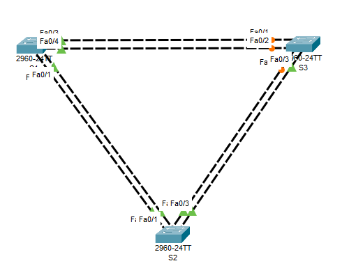
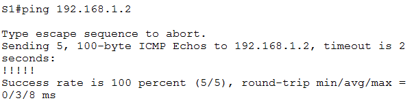
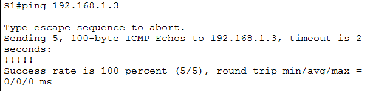
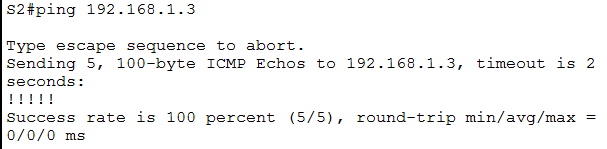
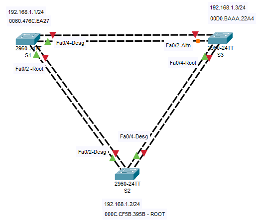

# Лабораторная работа. Развертывание коммутируемой сети с резервными каналами

## Топология



## 	Таблица адресации


## Цели
### Часть 1. Создание сети и настройка основных параметров устройства
### Часть 2. Выбор корневого моста
### Часть 3. Наблюдение за процессом выбора протоколом STP порта, исходя из стоимости портов
### Часть 4. Наблюдение за процессом выбора протоколом STP порта, исходя из приоритета портов
# __________________________________________________________________

### Часть 1:	Создание сети и настройка основных параметров устройства
**В части 1 вам предстоит настроить топологию сети и основные параметры маршрутизаторов.**
#### Шаг 1:	Создайте сеть согласно топологии.
**Подключите устройства, как показано в топологии, и подсоедините необходимые кабели.**

Собранная топология представлена выше.

#### Шаг 2:	Выполните инициализацию и перезагрузку коммутаторов.

```
reload
```
Выполнено для всех 3 коммутаторов.

#### Шаг 3:	Настройте базовые параметры каждого коммутатора.

**a.	Отключите поиск DNS.**
```
ip domain-name otus.ru
```
**b.	Присвойте имена устройствам в соответствии с топологией.**
```
hostname S1
```
Аналогично S2 и S3
**c.	Назначьте cisco в качестве зашифрованного пароля доступа к привилегированному режиму.**
```
enable secret 5 $1$mERr$hx5rVt7rPNoS4wqbXKX7m0
```
**d.	Назначьте cisco в качестве паролей консоли и VTY и активируйте вход для консоли и VTY каналов.**
```
username admin secret 5 $1$mERr$hx5rVt7rPNoS4wqbXKX7m0
line vty 0 4
 logging synchronous
 login local
 transport input ssh
```
**e.	Настройте logging synchronous для консольного канала.**
```
logging synchronous
```
**f.	Настройте баннерное сообщение дня (MOTD) для предупреждения пользователей о запрете несанкционированного доступа.**
```
banner motd ^C
**********************STOP!!!************************^C
```
**g.	Задайте IP-адрес, указанный в таблице адресации для VLAN 1 на всех коммутаторах.**
```
interface Vlan1
 ip address 192.168.1.2 255.255.255.0
```
**h.	Скопируйте текущую конфигурацию в файл загрузочной конфигурации.**
```
copy running-config startup-config
```
#### Шаг 4:	Проверьте связь.

**Проверьте способность компьютеров обмениваться эхо-запросами.**

**Успешно ли выполняется эхо-запрос от коммутатора S1 на коммутатор S2?	______________**



**Успешно ли выполняется эхо-запрос от коммутатора S1 на коммутатор S3?	______________**



**Успешно ли выполняется эхо-запрос от коммутатора S2 на коммутатор S3?	______________**



### Часть 2:	Определение корневого моста

#### Шаг 1:	Отключите все порты на коммутаторах.
```
conf t
interface range fastEthernet 0/1-4
shutdown 
```
И так для каждого коммутатора

#### Шаг 2:	Настройте подключенные порты в качестве транковых.
```
conf t
interface range fastEthernet 0/1-4
switchport mode trunk
```
И так для каждого коммутатора

#### Шаг 3:	Включите порты F0/2 и F0/4 на всех коммутаторах.
```
conf t
interface range fastEthernet 0/2, fastEthernet 0/4
no shutdown 
```
И так для каждого коммутатора

#### Шаг 4:	Отобразите данные протокола spanning-tree.
S1:
```
S1#sh sp
VLAN0001
  Spanning tree enabled protocol ieee
  Root ID    Priority    32769
             Address     000C.CF5B.395B
             Cost        19
             Port        2(FastEthernet0/2)
             Hello Time  2 sec  Max Age 20 sec  Forward Delay 15 sec

  Bridge ID  Priority    32769  (priority 32768 sys-id-ext 1)
             Address     0060.476C.EA27
             Hello Time  2 sec  Max Age 20 sec  Forward Delay 15 sec
             Aging Time  20

Interface        Role Sts Cost      Prio.Nbr Type
---------------- ---- --- --------- -------- --------------------------------
Fa0/2            Root FWD 19        128.2    P2p
Fa0/4            Desg FWD 19        128.4    P2p
```

S2:
```
S2#sh sp
VLAN0001
  Spanning tree enabled protocol ieee
  Root ID    Priority    32769
             Address     000C.CF5B.395B
             This bridge is the root
             Hello Time  2 sec  Max Age 20 sec  Forward Delay 15 sec

  Bridge ID  Priority    32769  (priority 32768 sys-id-ext 1)
             Address     000C.CF5B.395B
             Hello Time  2 sec  Max Age 20 sec  Forward Delay 15 sec
             Aging Time  20

Interface        Role Sts Cost      Prio.Nbr Type
---------------- ---- --- --------- -------- --------------------------------
Fa0/2            Desg FWD 19        128.2    P2p
Fa0/4            Desg FWD 19        128.4    P2p
```

S3:
```
S3#sh sp
VLAN0001
  Spanning tree enabled protocol ieee
  Root ID    Priority    32769
             Address     000C.CF5B.395B
             Cost        19
             Port        4(FastEthernet0/4)
             Hello Time  2 sec  Max Age 20 sec  Forward Delay 15 sec

  Bridge ID  Priority    32769  (priority 32768 sys-id-ext 1)
             Address     00D0.BAAA.22A4
             Hello Time  2 sec  Max Age 20 sec  Forward Delay 15 sec
             Aging Time  20

Interface        Role Sts Cost      Prio.Nbr Type
---------------- ---- --- --------- -------- --------------------------------
Fa0/4            Root FWD 19        128.4    P2p
Fa0/2            Altn BLK 19        128.2    P2p
```



*С учетом выходных данных, поступающих с коммутаторов, ответьте на следующие вопросы.
**Какой коммутатор является корневым мостом?** 

*S2*

**Почему этот коммутатор был выбран протоколом spanning-tree в качестве корневого моста?**

*000C.CF5B.395B - самый маленький BID у него*


**Какие порты на коммутаторе являются корневыми портами?**

*Смотрящие в сторону корневого моста и имеющие наименьшую стоимостью для достижения
корневого моста*

**Какие порты на коммутаторе являются назначенными портами?** 

*Выбираются для каждого сегмента (каждого канала), исходя из стоимости возврата к корневому мосту для любой стороны канала.*

**Какой порт отображается в качестве альтернативного и в настоящее время заблокирован?**

*S3-F0/2*

**Почему протокол spanning-tree выбрал этот порт в качестве невыделенного (заблокированного) порта?**

*Потому что в данном случае другая сторона не является корневым портом*

### Часть 3:	Наблюдение за процессом выбора протоколом STP порта, исходя из стоимости портов

#### Шаг 1:	Определите коммутатор с заблокированным портом.
**При текущей конфигурации только один коммутатор может содержать заблокированный протоколом STP порт.** 
**Выполните команду show spanning-tree на обоих коммутаторах некорневого моста.** 
S1:
```
S1#sh sp
VLAN0001
  Spanning tree enabled protocol ieee
  Root ID    Priority    32769
             Address     000C.CF5B.395B
             Cost        19
             Port        2(FastEthernet0/2)
             Hello Time  2 sec  Max Age 20 sec  Forward Delay 15 sec

  Bridge ID  Priority    32769  (priority 32768 sys-id-ext 1)
             Address     0060.476C.EA27
             Hello Time  2 sec  Max Age 20 sec  Forward Delay 15 sec
             Aging Time  20

Interface        Role Sts Cost      Prio.Nbr Type
---------------- ---- --- --------- -------- --------------------------------
Fa0/2            Root FWD 19        128.2    P2p
Fa0/4            Desg FWD 19        128.4    P2p
```

S3:
```
S3#sh sp
VLAN0001
  Spanning tree enabled protocol ieee
  Root ID    Priority    32769
             Address     000C.CF5B.395B
             Cost        19
             Port        4(FastEthernet0/4)
             Hello Time  2 sec  Max Age 20 sec  Forward Delay 15 sec

  Bridge ID  Priority    32769  (priority 32768 sys-id-ext 1)
             Address     00D0.BAAA.22A4
             Hello Time  2 sec  Max Age 20 sec  Forward Delay 15 sec
             Aging Time  20

Interface        Role Sts Cost      Prio.Nbr Type
---------------- ---- --- --------- -------- --------------------------------
Fa0/4            Root FWD 19        128.4    P2p
Fa0/2            Altn BLK 19        128.2    P2p
```

**В нашем случае протокол spanning-tree блокирует порт F0/2 на коммутаторе с самым высоким идентификатором BID 00D0.BAAA.22A4 (S3).**

#### Шаг 2:	Изменим стоимость порта.

**Помимо заблокированного порта, единственным активным портом на этом коммутаторе является порт, выделенный в качестве порта корневого моста.**

**Уменьшите стоимость этого порта корневого моста до 18, выполнив команду spanning-tree vlan 1 cost 18 режима конфигурации интерфейса.**
```
S3(config)# interface f0/4
S3(config-if)# spanning-tree vlan 1 cost 18
```

#### Шаг 3:	Просмотрите изменения протокола spanning-tree.

**Повторно выполните команду show spanning-tree на обоих коммутаторах некорневого моста.**

**Обратите внимание, что ранее заблокированный порт (S1 – F0/4) теперь является назначенным портом, и протокол spanning-tree теперь блокирует порт на другом коммутаторе некорневого моста (S3 – F0/4).**
S1:
```
S1#sh sp
VLAN0001
  Spanning tree enabled protocol ieee
  Root ID    Priority    32769
             Address     000C.CF5B.395B
             Cost        19
             Port        2(FastEthernet0/2)
             Hello Time  2 sec  Max Age 20 sec  Forward Delay 15 sec

  Bridge ID  Priority    32769  (priority 32768 sys-id-ext 1)
             Address     0060.476C.EA27
             Hello Time  2 sec  Max Age 20 sec  Forward Delay 15 sec
             Aging Time  20

Interface        Role Sts Cost      Prio.Nbr Type
---------------- ---- --- --------- -------- --------------------------------
Fa0/2            Root FWD 19        128.2    P2p
Fa0/4            Altn BLK 19        128.4    P2p
```
S3:
```
S3(config-if)#do sh sp
VLAN0001
  Spanning tree enabled protocol ieee
  Root ID    Priority    32769
             Address     000C.CF5B.395B
             Cost        18
             Port        4(FastEthernet0/4)
             Hello Time  2 sec  Max Age 20 sec  Forward Delay 15 sec

  Bridge ID  Priority    32769  (priority 32768 sys-id-ext 1)
             Address     00D0.BAAA.22A4
             Hello Time  2 sec  Max Age 20 sec  Forward Delay 15 sec
             Aging Time  20

Interface        Role Sts Cost      Prio.Nbr Type
---------------- ---- --- --------- -------- --------------------------------
Fa0/4            Root FWD 18        128.4    P2p
Fa0/2            Desg FWD 19        128.2    P2p
```
**Почему протокол spanning-tree заменяет ранее заблокированный порт на назначенный порт и блокирует порт, 
который был назначенным портом на другом коммутаторе?**

*Это связано со стоимостью маршрута и номером порта*

#### Шаг 4:	Удалите изменения стоимости порта.
**a.	Выполните команду no spanning-tree vlan 1 cost 18 режима конфигурации интерфейса, чтобы удалить запись стоимости, созданную ранее.**
```
S3(config)# interface f0/4
S3(config-if)# no spanning-tree vlan 1 cost 18
```
**b.	Повторно выполните команду show spanning-tree, чтобы подтвердить, что протокол STP сбросил порт на коммутаторе некорневого моста, вернув исходные настройки порта. Протоколу STP требуется примерно 30 секунд, чтобы завершить процесс перевода порта.**
```
S3(config-if)#do sh sp
VLAN0001
  Spanning tree enabled protocol ieee
  Root ID    Priority    32769
             Address     000C.CF5B.395B
             Cost        19
             Port        4(FastEthernet0/4)
             Hello Time  2 sec  Max Age 20 sec  Forward Delay 15 sec

  Bridge ID  Priority    32769  (priority 32768 sys-id-ext 1)
             Address     00D0.BAAA.22A4
             Hello Time  2 sec  Max Age 20 sec  Forward Delay 15 sec
             Aging Time  20

Interface        Role Sts Cost      Prio.Nbr Type
---------------- ---- --- --------- -------- --------------------------------
Fa0/4            Root FWD 19        128.4    P2p
Fa0/2            Desg FWD 19        128.2    P2p
```
### Часть 4:	Наблюдение за процессом выбора протоколом STP порта, исходя из приоритета портов

**a.	Включите порты F0/1 и F0/3 на всех коммутаторах.**

```
conf t
interface range fastEthernet 0/1, fastEthernet 0/3
no shutdown 
```
И так для всех коммутаторов

**Порт корневого моста переместился на порт с меньшим номером, связанный с коммутатором корневого моста, и заблокировал предыдущий порт корневого моста.**

S1:
```
S1# sh sp
VLAN0001
  Spanning tree enabled protocol ieee
  Root ID    Priority    32769
             Address     000C.CF5B.395B
             Cost        19
             Port        1(FastEthernet0/1)
             Hello Time  2 sec  Max Age 20 sec  Forward Delay 15 sec

  Bridge ID  Priority    32769  (priority 32768 sys-id-ext 1)
             Address     0060.476C.EA27
             Hello Time  2 sec  Max Age 20 sec  Forward Delay 15 sec
             Aging Time  20

Interface        Role Sts Cost      Prio.Nbr Type
---------------- ---- --- --------- -------- --------------------------------
Fa0/1            Root FWD 19        128.1    P2p
Fa0/2            Altn BLK 19        128.2    P2p
Fa0/3            Desg FWD 19        128.3    P2p
Fa0/4            Desg FWD 19        128.4    P2p
```

S3:
```
S3#sh sp
VLAN0001
  Spanning tree enabled protocol ieee
  Root ID    Priority    32769
             Address     000C.CF5B.395B
             Cost        19
             Port        3(FastEthernet0/3)
             Hello Time  2 sec  Max Age 20 sec  Forward Delay 15 sec

  Bridge ID  Priority    32769  (priority 32768 sys-id-ext 1)
             Address     00D0.BAAA.22A4
             Hello Time  2 sec  Max Age 20 sec  Forward Delay 15 sec
             Aging Time  20

Interface        Role Sts Cost      Prio.Nbr Type
---------------- ---- --- --------- -------- --------------------------------
Fa0/3            Root FWD 19        128.3    P2p
Fa0/4            Altn BLK 19        128.4    P2p
Fa0/1            Altn BLK 19        128.1    P2p
Fa0/2            Altn BLK 19        128.2    P2p
```
**Какой порт выбран протоколом STP в качестве порта корневого моста на каждом коммутаторе некорневого моста?** 

*S1: Fa0/1 Root*

*S3: Fa0/3 Root*

**Почему протокол STP выбрал эти порты в качестве портов корневого моста на этих коммутаторах?**

*Исходя из стоимости маршрута. Стоимость определяется суммой стоимостей всех линков, которые нужно пройти кадру, чтобы дойти до корневого свича*

**Вопросы для повторения**

**1.	Какое значение протокол STP использует первым после выбора корневого моста, чтобы определить выбор порта?**

*Порт с более низкой стоимостью пути является предпочтительным*

**2.	Если первое значение на двух портах одинаково, какое следующее значение будет использовать протокол STP при выборе порта?**

*Если стоимости портов равны, процесс сравнивает номер порта*

**3.	Если оба значения на двух портах равны, каким будет следующее значение, которое использует протокол STP при выборе порта?**

*Если номер и приоритет равны, то сравнивается BID*


