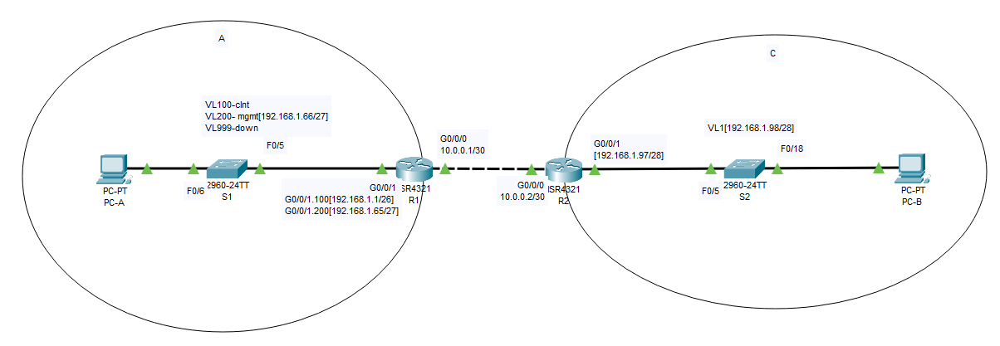
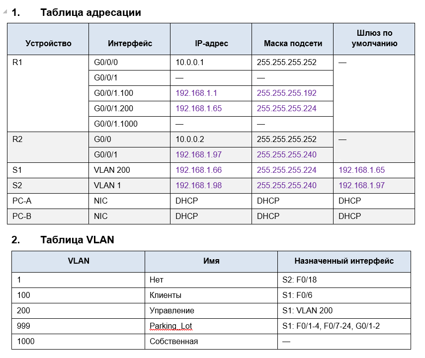
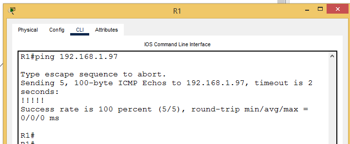
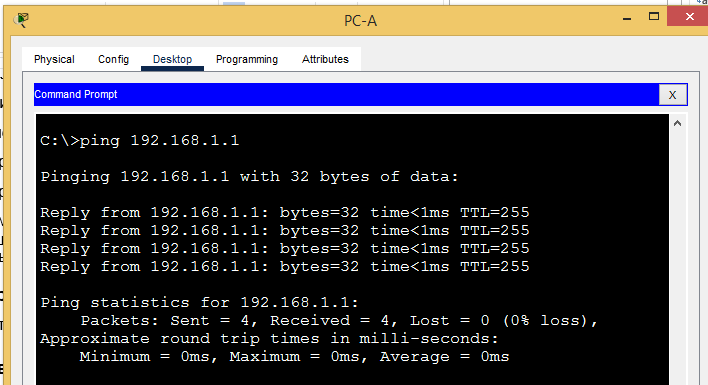
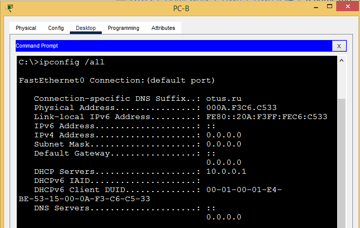
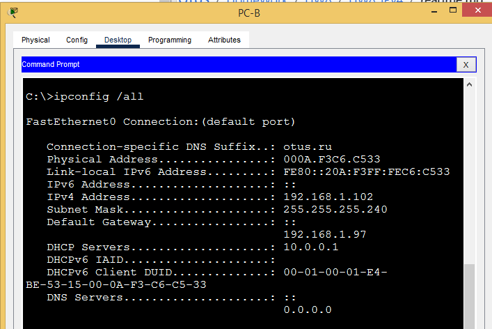
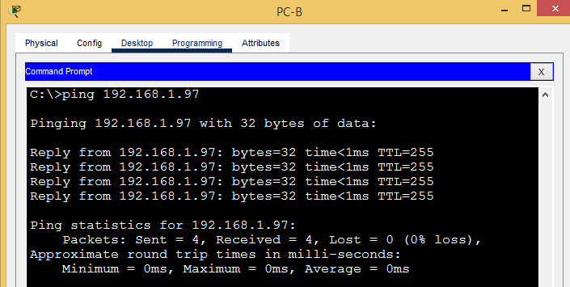

# Лабораторная работа - Реализация DHCPv4

## Топология





## 3.	Задачи
   
## Часть 1. Создание сети и настройка основных параметров устройства

## Часть 2. Настройка и проверка двух серверов DHCPv4 на R1

## Часть 3. Настройка и проверка DHCP-ретрансляции на R2
## _____________________________________________________________________________
## ХОД РАБОТЫ 

### Шаг 1.	Создание схемы адресации

**Подсеть сети 192.168.1.0/24 в соответствии со следующими требованиями:**

**a.	Одна подсеть «Подсеть A», поддерживающая 58 хостов (клиентская VLAN на R1).**

**Подсеть A:** ***192.168.1.0/26***

**Запишите первый IP-адрес в таблице адресации для R1 G0/0/1.100 .** 

**b.	Одна подсеть «Подсеть B», поддерживающая 28 хостов (управляющая VLAN на R1).**

**Подсеть B:** ***192.168.1.64/27***

**Запишите первый IP-адрес в таблице адресации для R1 G0/0/1.200.**

**Запишите второй IP-адрес в таблице адресов для S1 VLAN 200 и введите соответствующий шлюз по умолчанию.**

**c.	Одна подсеть «Подсеть C», поддерживающая 12 узлов (клиентская сеть на R2).**

**Подсеть C:** ***192.168.1.96/28***

**Запишите первый IP-адрес в таблице адресации для R2 G0/0/1.**

### Шаг 2.	Создайте сеть согласно топологии.

**Подключите устройства, как показано в топологии, и подсоедините необходимые кабели.**

***Топология представлена выше.***

### Шаг 3.	Произведите базовую настройку маршрутизаторов.
**a.	Назначьте маршрутизатору имя устройства.**
```
S1#hostname S1
```
**b.	Отключите поиск DNS, чтобы предотвратить попытки маршрутизатора неверно преобразовывать введенные команды таким образом, как будто они являются именами узлов.**
```
no ip domain-lookup
```
**c.	Назначьте cisco в качестве зашифрованного пароля привилегированного режима EXEC.**
```
enable secret 5 $1$mERr$hx5rVt7rPNoS4wqbXKX7m0
```
**d.	Назначьте cisco в качестве пароля консоли и включите вход в систему по паролю.**
```
line con 0
 password 7 0822455D0A16
```
**e.	Назначьте cisco в качестве пароля VTY и включите вход в систему по паролю.**
```
username admin secret 5 $1$mERr$hx5rVt7rPNoS4wqbXKX7m0
line vty 0 4
 login local
 transport input ssh
```
**f.	Зашифруйте открытые пароли.**
```
service password-encryption
```
**g.	Создайте баннер с предупреждением о запрете несанкционированного доступа к устройству.**
```
banner motd ^C
***************STOP!!!********************^C
```
**h.	Сохраните текущую конфигурацию в файл загрузочной конфигурации.**
```
S1#copy running-config startup-config
```
**i.	Установите часы на маршрутизаторе на сегодняшнее время и дату.**
```
S1#clock set 
```

### Шаг 4.	Настройка маршрутизации между сетями VLAN на маршрутизаторе R1

**a.	Активируйте интерфейс G0/0/1 на маршрутизаторе.**
```
interface GigabitEthernet0/0/1
no sh
```
**b.	Настройте подинтерфейсы для каждой VLAN в соответствии с требованиями таблицы IP-адресации.**

**Все субинтерфейсы используют инкапсуляцию 802.1Q и назначаются первый полезный адрес из вычисленного пула IP-адресов.**

**Убедитесь, что подинтерфейсу для native VLAN не назначен IP-адрес. Включите описание для каждого подинтерфейса.**

**c.	Убедитесь, что вспомогательные интерфейсы работают.**

***b, c :***

```
interface GigabitEthernet0/0/0
 ip address 10.0.0.1 255.255.255.252
 duplex auto
 speed auto
!
interface GigabitEthernet0/0/1
 no ip address
 duplex auto
 speed auto
!
interface GigabitEthernet0/0/1.100
 description CLIENTS
 encapsulation dot1Q 100
 ip address 192.168.1.1 255.255.255.192
!
interface GigabitEthernet0/0/1.200
 description MGMT
 encapsulation dot1Q 200
 ip address 192.168.1.65 255.255.255.224
!
interface GigabitEthernet0/0/1.1000
 description NATIVE
 encapsulation dot1Q 1000 native
 no ip address
```
***Вспомогательные интерфейсы включены и настроены.***

### Шаг 5.	Настройте G0/1 на R2, затем G0/0/0 и статическую маршрутизацию для обоих маршрутизаторов

**a.	Настройте G0/0/1 на R2 с первым IP-адресом подсети C, рассчитанным ранее.**
```
interface GigabitEthernet0/0/1
 ip address 192.168.1.97 255.255.255.240
```
**b.	Настройте интерфейс G0/0/0 для каждого маршрутизатора на основе приведенной выше таблицы IP-адресации.**
```
interface GigabitEthernet0/0/0
 ip address 10.0.0.2 255.255.255.252
```
**c.	Настройте маршрут по умолчанию на каждом маршрутизаторе, указываемом на IP-адрес G0/0/0 на другом маршрутизаторе.**
```
ip route 0.0.0.0 0.0.0.0 10.0.0.1 - R2
ip route 0.0.0.0 0.0.0.0 10.0.0.2 - R1
```
**d.	Убедитесь, что статическая маршрутизация работает с помощью пинга до адреса G0/0/1 R2 от R1.**



**e.	Сохраните текущую конфигурацию в файл загрузочной конфигурации.**
```
#copy running-config startup-config
```
## Шаг 6.	Настройте базовые параметры каждого коммутатора.

**a.	Присвойте коммутатору имя устройства.**
```
hostname S1
```
**b.	Отключите поиск DNS, чтобы предотвратить попытки маршрутизатора неверно преобразовывать введенные команды таким образом, как будто они являются именами узлов.**
```
no ip domain-lookup
```
**c.	Назначьте cisco в качестве зашифрованного пароля привилегированного режима EXEC.**
```
enable secret 5 $1$mERr$hx5rVt7rPNoS4wqbXKX7m0
```
**d.	Назначьте cisco в качестве пароля консоли и включите вход в систему по паролю.**
```
line con 0
 password 7 0822455D0A16
```
**e.	Назначьте cisco в качестве пароля VTY и включите вход в систему по паролю.**
```
line vty 0 4
 login local
 transport input ssh
username admin secret 5 $1$mERr$hx5rVt7rPNoS4wqbXKX7m0
```
**f.	Зашифруйте открытые пароли.**
```
service password-encryption
```
**g.	Создайте баннер с предупреждением о запрете несанкционированного доступа к устройству.**
```
banner motd ^C
***************STOP!!!********************^C
```
**i.	Установите часы на маршрутизаторе на сегодняшнее время и дату.**
```
clock set 22:11:22 feb 20 2026  
```
**j.	Скопируйте текущую конфигурацию в файл загрузочной конфигурации.**
```
copy running-config startup-config 
```

## Шаг 7.	Создайте сети VLAN на коммутаторе S1.

**Примечание. S2 настроен только с базовыми настройками.**

**a.	Создайте необходимые VLAN на коммутаторе 1 и присвойте им имена из приведенной выше таблицы.**
```
S1#sh vlan brief

VLAN Name                             Status    Ports
---- -------------------------------- --------- -------------------------------
1    default                          active    
100  CLIENTS                          active    Fa0/6
200  MGMT                             active    
999  ParkingLot                       active    Fa0/1, Fa0/2, Fa0/3, Fa0/4
                                                Fa0/7, Fa0/8, Fa0/9, Fa0/10
                                                Fa0/11, Fa0/12, Fa0/13, Fa0/14
                                                Fa0/15, Fa0/16, Fa0/17, Fa0/18
                                                Fa0/19, Fa0/20, Fa0/21, Fa0/22
                                                Fa0/23, Fa0/24, Gig0/1, Gig0/2
1000 NATIVE                           active
```
**b.	Настройте и активируйте интерфейс управления на S1 (VLAN 200), используя второй IP-адрес из подсети, рассчитанный ранее.**
```
interface Vlan200
 description MGMT
 ip address 192.168.1.66 255.255.255.224
```
**Кроме того установите шлюз по умолчанию на S1.**
```
ip default-gateway 192.168.1.65
```
**c.	Настройте и активируйте интерфейс управления на S2 (VLAN 1), используя второй IP-адрес из подсети, рассчитанный ранее.** 
```
interface Vlan1
 ip address 192.168.1.98 255.255.255.240
```
**Кроме того, установите шлюз по умолчанию на S2**
```
ip default-gateway 192.168.1.97
```
**d.	Назначьте все неиспользуемые порты S1 VLAN Parking_Lot, настройте их для статического режима доступа и административно деактивируйте их.** 
```
999  ParkingLot                       active    Fa0/1, Fa0/2, Fa0/3, Fa0/4
                                                Fa0/7, Fa0/8, Fa0/9, Fa0/10
                                                Fa0/11, Fa0/12, Fa0/13, Fa0/14
                                                Fa0/15, Fa0/16, Fa0/17, Fa0/18
                                                Fa0/19, Fa0/20, Fa0/21, Fa0/22
                                                Fa0/23, Fa0/24, Gig0/1, Gig0/2

interface range FastEthernet 0/1 - 4, FastEthernet Fa0/7-24, Gig0/1-2
 switchport access vlan 999
 shutdown
```
**На S2 административно деактивируйте все неиспользуемые порты.**
```
interface range FastEthernet 0/1 - 4, FastEthernet Fa0/6-17, FastEthernet Fa0/19-24, Gig0/1-2
 shutdown
```
## Шаг 8.	Назначьте сети VLAN соответствующим интерфейсам коммутатора.
**a.	Назначьте используемые порты соответствующей VLAN (указанной в таблице VLAN выше) и настройте их для режима статического доступа.**

```
R1:
interface FastEthernet0/5
 switchport trunk native vlan 1000
 switchport trunk allowed vlan 100,200,1000
 switchport mode trunk
 switchport nonegotiate
!
interface FastEthernet0/6
 switchport access vlan 100
 switchport mode access
 switchport nonegotiate
```

```
 R2:

interface FastEthernet0/5
 switchport mode trunk
 switchport nonegotiate
!
 interface FastEthernet0/18
 switchport mode access
 switchport nonegotiate
 !
 S2#sh interfaces trunk 
 
 Port        Mode         Encapsulation  Status        Native vlan
 Fa0/5       on           802.1q         trunking      1
```

**Вопрос:
     Почему интерфейс F0/5 указан в VLAN 1?**

***Потому что настройки базовая конфигурация подразумевает нахождение всех интерфейсов в нативном vlan 1, как следует из примечания "S2 настроен только с базовыми настройками"***

## Шаг 9.	Вручную настройте интерфейс S1 F0/5 в качестве транка 802.1Q.

**a.	Измените режим порта коммутатора, чтобы принудительно создать магистральный канал.**
```
interface FastEthernet0/5
 switchport mode trunk
 switchport nonegotiate
```
**b.	В рамках конфигурации транка  установите для native  VLAN значение 1000.**
```
interface FastEthernet0/5
 switchport trunk native vlan 1000
```
**c.	В качестве другой части конфигурации магистрали укажите, что VLAN 100, 200 и 1000 могут проходить по транку.**
```
interface FastEthernet0/5
 switchport trunk allowed vlan 100,200,1000
```
**d.	Проверьте состояние транка.**
```
S1#show interfaces trunk 
Port        Mode         Encapsulation  Status        Native vlan
Fa0/5       on           802.1q         trunking      1000

Port        Vlans allowed on trunk
Fa0/5       100,200,1000

Port        Vlans allowed and active in management domain
Fa0/5       100,200,1000

Port        Vlans in spanning tree forwarding state and not pruned
Fa0/5       100,200,1000
```
**Вопрос:**

**Какой IP-адрес был бы у ПК, если бы он был подключен к сети с помощью DHCP?**

***Адрес был бы динамический***

## Часть 2.	Настройка и проверка двух серверов DHCPv4 на R1

**В части 2 необходимо настроить и проверить сервер DHCPv4 на R1. Сервер DHCPv4 будет обслуживать две подсети, подсеть A и подсеть C.**

**Шаг 1.	Настройте R1 с пулами DHCPv4 для двух поддерживаемых подсетей.**

**a.	Исключите первые пять используемых адресов из каждого пула адресов.**
```
ip dhcp excluded-address 192.168.1.1 192.168.1.5
ip dhcp excluded-address 192.168.1.97 192.168.1.101
```
**b.	Создайте пул DHCP (используйте уникальное имя для каждого пула).**
```
ip dhcp pool LAN-A
ip dhcp pool LAN-C
```
**c.	Укажите сеть, поддерживающую этот DHCP-сервер.**
```
ip dhcp pool LAN-A
 network 192.168.1.0 255.255.255.192
ip dhcp pool LAN-C
 network 192.168.1.96 255.255.255.240
 ```
**d.	В качестве имени домена укажите otus.ru.**
```
ip dhcp pool LAN-A
 network 192.168.1.0 255.255.255.192
 domain-name otus.ru
 ```
**e.	Настройте соответствующий шлюз по умолчанию для каждого пула DHCP.**
```
ip dhcp pool LAN-A
 network 192.168.1.0 255.255.255.192
 default-router 192.168.1.1
ip dhcp pool LAN-C
 network 192.168.1.96 255.255.255.240
 default-router 192.168.1.97
```

**Шаг 2.	Сохраните конфигурацию.**
```
R2#copy running-config startup-config 
```
**Шаг 3.	Проверка конфигурации сервера DHCPv4**

**a.	Чтобы просмотреть сведения о пуле, выполните команду show ip dhcp pool.**
```
R1#show ip dhcp pool 

Pool LAN-A :
 Utilization mark (high/low)    : 100 / 0
 Subnet size (first/next)       : 0 / 0 
 Total addresses                : 62
 Leased addresses               : 1
 Excluded addresses             : 2
 Pending event                  : none

 1 subnet is currently in the pool
 Current index        IP address range                    Leased/Excluded/Total
 192.168.1.1          192.168.1.1      - 192.168.1.62      1    / 2     / 62

Pool LAN-C :
 Utilization mark (high/low)    : 100 / 0
 Subnet size (first/next)       : 0 / 0 
 Total addresses                : 14
 Leased addresses               : 1
 Excluded addresses             : 2
 Pending event                  : none

 1 subnet is currently in the pool
 Current index        IP address range                    Leased/Excluded/Total
 192.168.1.97         192.168.1.97     - 192.168.1.110     1    / 2     / 14
```
**b.	Выполните команду show ip dhcp binding для проверки установленных назначений адресов DHCP.**
```
R1#show ip dhcp binding
IP address       Client-ID/              Lease expiration        Type
                 Hardware address
192.168.1.6      0006.2AC4.CB2B           --                     Automatic
192.168.1.102    000A.F3C6.C533           --                     Automatic
```
**Шаг 4.	Попытка получить IP-адрес от DHCP на PC-A**

**a.	Из командной строки компьютера PC-A выполните команду ipconfig /all.**
```
C:\> ipconfig /all

FastEthernet0 Connection:(default port)

   Connection-specific DNS Suffix..: otus.ru
   Physical Address................: 0006.2AC4.CB2B
   Link-local IPv6 Address.........: FE80::206:2AFF:FEC4:CB2B
   IPv6 Address....................: ::
   IPv4 Address....................: 0.0.0.0
   Subnet Mask.....................: 0.0.0.0
   Default Gateway.................: ::
                                     0.0.0.0
   DHCP Servers....................: 192.168.1.1
   DHCPv6 IAID.....................: 
   DHCPv6 Client DUID..............: 00-01-00-01-EC-DE-8A-D4-00-06-2A-C4-CB-2B
   DNS Servers.....................: ::
                                     0.0.0.0

```
**b.	После завершения процесса обновления выполните команду ipconfig для просмотра новой информации об IP-адресе.**
```
C:\> ipconfig /all

FastEthernet0 Connection:(default port)

   Connection-specific DNS Suffix..: otus.ru
   Physical Address................: 0006.2AC4.CB2B
   Link-local IPv6 Address.........: FE80::206:2AFF:FEC4:CB2B
   IPv6 Address....................: ::
   IPv4 Address....................: 192.168.1.6
   Subnet Mask.....................: 255.255.255.192
   Default Gateway.................: ::
                                     192.168.1.1
   DHCP Servers....................: 192.168.1.1
   DHCPv6 IAID.....................: 
   DHCPv6 Client DUID..............: 00-01-00-01-EC-DE-8A-D4-00-06-2A-C4-CB-2B
   DNS Servers.....................: ::
                                     0.0.0.0
```
**c.	Проверьте подключение с помощью пинга IP-адреса интерфейса R1 G0/0/1.**



## Часть 3.	Настройка и проверка DHCP-ретрансляции на R2

**В части 3 настраивается R2 для ретрансляции DHCP-запросов из локальной сети на интерфейсе G0/0/1 на DHCP-сервер (R1).**

**Шаг 1.	Настройка R2 в качестве агента DHCP-ретрансляции для локальной сети на G0/0/1**

**a.	Настройте команду ip helper-address на G0/0/1, указав IP-адрес G0/0/0 R1.**
```
!
interface GigabitEthernet0/0/1
 ip address 192.168.1.97 255.255.255.240
 ip helper-address 10.0.0.1
```
**Шаг 2.	Попытка получить IP-адрес от DHCP на PC-B**

a.	Из командной строки компьютера PC-B выполните команду ipconfig /all.



b.	После завершения процесса обновления выполните команду ipconfig для просмотра новой информации об IP-адресе.



c.	Проверьте подключение с помощью пинга IP-адреса интерфейса R1 G0/0/1.



d.	Выполните show ip dhcp binding для R1 для проверки назначений адресов в DHCP.
```
R1#show ip dhcp binding 
IP address       Client-ID/              Lease expiration        Type
                 Hardware address
192.168.1.6      0006.2AC4.CB2B           --                     Automatic
192.168.1.102    000A.F3C6.C533           --                     Automatic
```


