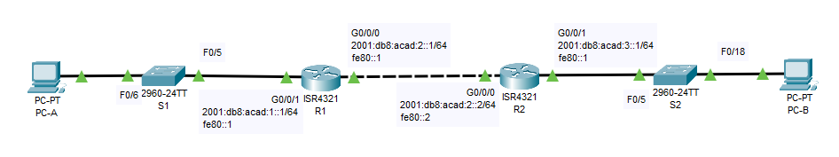
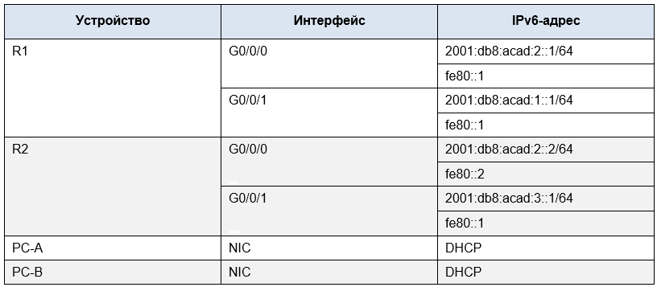
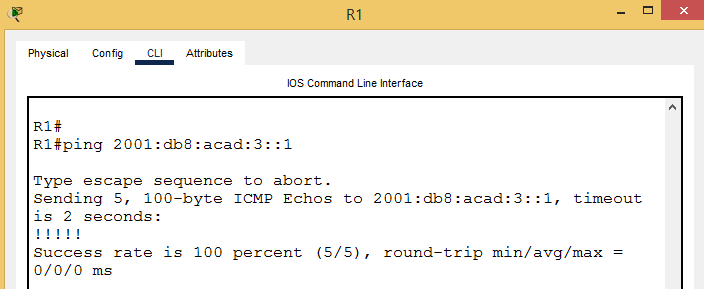
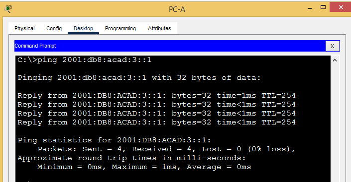

# Лабраторная работа - Настройка DHCPv6 

## Топология



## Таблица адресации



## Задачи

**Часть 1. Создание сети и настройка основных параметров устройства**

**Часть 2. Проверка назначения адреса SLAAC от R1**

**Часть 3. Настройка и проверка сервера DHCPv6 без гражданства на R1**

**Часть 4. Настройка и проверка состояния DHCPv6 сервера на R1**

## _____________________________________________________________________
## Ход работы

# Часть 1. Создание сети и настройка основных параметров устройства

**В первой части лабораторной работы вам предстоит создать топологию сети и настроить базовые параметры для 
узлов ПК и коммутаторов.**

## Шаг 1. Создайте сеть согласно топологии.

**Подключите устройства, как показано в топологии, и подсоедините необходимые кабели.**

## Шаг 2. Настройте базовые параметры каждого коммутатора. (необязательно)
```
S1#sh r
Building configuration...

Current configuration : 1598 bytes
!
version 15.0
no service timestamps log datetime msec
no service timestamps debug datetime msec
no service password-encryption
!
hostname S1
!
!
enable secret 5 $1$mERr$hx5rVt7rPNoS4wqbXKX7m0
!
!
!
ip ssh version 2
no ip domain-lookup
ip domain-name otus.ru
!
username admin secret 5 $1$mERr$hx5rVt7rPNoS4wqbXKX7m0
!
!
!
spanning-tree mode pvst
spanning-tree extend system-id
!
interface FastEthernet0/1
 shutdown
!
interface FastEthernet0/2
 shutdown
!
interface FastEthernet0/3
 shutdown
!
interface FastEthernet0/4
 shutdown
!
interface FastEthernet0/5
!
interface FastEthernet0/6
!
interface FastEthernet0/7
 shutdown
!
interface FastEthernet0/8
 shutdown
!
interface FastEthernet0/9
 shutdown
!
interface FastEthernet0/10
 shutdown
!
interface FastEthernet0/11
 shutdown
!
interface FastEthernet0/12
 shutdown
!
interface FastEthernet0/13
 shutdown
!
interface FastEthernet0/14
 shutdown
!
interface FastEthernet0/15
 shutdown
!
interface FastEthernet0/16
 shutdown
!
interface FastEthernet0/17
 shutdown
!
interface FastEthernet0/18
 shutdown
!
interface FastEthernet0/19
 shutdown
!
interface FastEthernet0/20
 shutdown
!
interface FastEthernet0/21
 shutdown
!
interface FastEthernet0/22
 shutdown
!
interface FastEthernet0/23
 shutdown
!
interface FastEthernet0/24
 shutdown
!
interface GigabitEthernet0/1
 shutdown
!
interface GigabitEthernet0/2
 shutdown
!
interface Vlan1
 no ip address
 shutdown
!
banner motd ^C
***************STOP!!!********************^C
!
!
!
!
!
line con 0
 password 7 0822455D0A16
!
line vty 0 4
 login local
 transport input ssh
line vty 5 15
 login
!
!
!
!
end
```
```
S2#sh r
Building configuration...

Current configuration : 1598 bytes
!
version 15.0
no service timestamps log datetime msec
no service timestamps debug datetime msec
no service password-encryption
!
hostname S2
!
!
enable secret 5 $1$mERr$hx5rVt7rPNoS4wqbXKX7m0
!
!
!
ip ssh version 2
no ip domain-lookup
ip domain-name otus.ru
!
username admin secret 5 $1$mERr$hx5rVt7rPNoS4wqbXKX7m0
!
!
!
spanning-tree mode pvst
spanning-tree extend system-id
!
interface FastEthernet0/1
 shutdown
!
interface FastEthernet0/2
 shutdown
!
interface FastEthernet0/3
 shutdown
!
interface FastEthernet0/4
 shutdown
!
interface FastEthernet0/5
!
interface FastEthernet0/6
 shutdown
!
interface FastEthernet0/7
 shutdown
!
interface FastEthernet0/8
 shutdown
!
interface FastEthernet0/9
 shutdown
!
interface FastEthernet0/10
 shutdown
!
interface FastEthernet0/11
 shutdown
!
interface FastEthernet0/12
 shutdown
!
interface FastEthernet0/13
 shutdown
!
interface FastEthernet0/14
 shutdown
!
interface FastEthernet0/15
 shutdown
!
interface FastEthernet0/16
 shutdown
!
interface FastEthernet0/17
 shutdown
!
interface FastEthernet0/18
!
interface FastEthernet0/19
 shutdown
!
interface FastEthernet0/20
 shutdown
!
interface FastEthernet0/21
 shutdown
!
interface FastEthernet0/22
 shutdown
!
interface FastEthernet0/23
 shutdown
!
interface FastEthernet0/24
 shutdown
!
interface GigabitEthernet0/1
 shutdown
!
interface GigabitEthernet0/2
 shutdown
!
interface Vlan1
 no ip address
 shutdown
!
banner motd ^C
***************STOP!!!********************^C
!
!
!
!
!
line con 0
 password 7 0822455D0A16
!
line vty 0 4
 login local
 transport input ssh
line vty 5 15
 login
!
!
!
!
end
```

## Шаг 3. Произведите базовую настройку маршрутизаторов.

**a.	Назначьте маршрутизатору имя устройства.**
```
hostname R1
```
**b.	Отключите поиск DNS, чтобы предотвратить попытки маршрутизатора неверно преобразовывать введенные команды таким образом, как будто они являются именами узлов.**
```
no ip domain-lookup
```
**c.	Назначьте cisco в качестве зашифрованного пароля привилегированного режима EXEC.**
```
enable secret 5 $1$mERr$hx5rVt7rPNoS4wqbXKX7m0
```
**d.	Назначьте cisco в качестве пароля консоли и включите вход в систему по паролю.**
```
enable secret 5 $1$mERr$hx5rVt7rPNoS4wqbXKX7m0
line con 0
 password 7 0822455D0A16
```
**e.	Назначьте cisco в качестве пароля VTY и включите вход в систему по паролю.**
```
username admin secret 5 $1$mERr$hx5rVt7rPNoS4wqbXKX7m0
line vty 0 4
 login local
 transport input ssh
```
**f.	Зашифруйте открытые пароли.**
```
service password-encryption
```
**g.	Создайте баннер с предупреждением о запрете несанкционированного доступа к устройству.**
```
banner motd ^C
***************STOP!!!********************^C
```
**h.	Активация IPv6-маршрутизации**
```
ipv6 unicast-routing
```
***Базовая настройка R2 аналогична.***

## Шаг 4. Настройка интерфейсов и маршрутизации для обоих маршрутизаторов.

**a.	Настройте интерфейсы G0/0/0 и G0/1 на R1 и R2 с адресами IPv6, указанными в таблице выше.**
```
R1:
interface GigabitEthernet0/0/0
 no ip address
 duplex auto
 speed auto
 ipv6 address FE80::1 link-local
 ipv6 address 2001:DB8:ACAD:2::1/64
!
interface GigabitEthernet0/0/1
 no ip address
 duplex auto
 speed auto
 ipv6 address FE80::1 link-local
 ipv6 address 2001:DB8:ACAD:1::1/64
 ipv6 nd other-config-flag
 ipv6 dhcp server R1-STATELESS
!
```
```
R2:
interface GigabitEthernet0/0/0
 no ip address
 duplex auto
 speed auto
 ipv6 address FE80::2 link-local
 ipv6 address 2001:DB8:ACAD:2::2/64
!
interface GigabitEthernet0/0/1
 no ip address
 duplex auto
 speed auto
 ipv6 address FE80::1 link-local
 ipv6 address 2001:DB8:ACAD:3::1/64
 ipv6 nd other-config-flag
 ipv6 dhcp server R2-STATELESS
```
**b.	Настройте маршрут по умолчанию на каждом маршрутизаторе, который указывает на IP-адрес G0/0/0 на другом маршрутизаторе.**
```
R1:
ipv6 route ::/0 2001:DB8:ACAD:2::2
```
```
R2:
ipv6 route ::/0 2001:DB8:ACAD:2::1
```
**c.	Убедитесь, что маршрутизация работает с помощью пинга адреса G0/0/1 R2 из R1**



# Часть 2. Проверка назначения адреса SLAAC от R1

**В части 2 вы убедитесь, что узел PC-A получает адрес IPv6 с помощью метода SLAAC.**

**Включите PC-A и убедитесь, что сетевой адаптер настроен для автоматической настройки IPv6.**

**Через несколько минут результаты команды ipconfig должны показать, что PC-A присвоил себе адрес из сети 2001:db8:1::/64.**

```
C:\>ipconfig /all

FastEthernet0 Connection:(default port)

   Connection-specific DNS Suffix..: STATELESS.com 
   Physical Address................: 00E0.F7DB.60E5
   Link-local IPv6 Address.........: FE80::2E0:F7FF:FEDB:60E5
   IPv6 Address....................: 2001:DB8:ACAD:1:2E0:F7FF:FEDB:60E5
   IPv4 Address....................: 0.0.0.0
   Subnet Mask.....................: 0.0.0.0
   Default Gateway.................: FE80::1
                                     0.0.0.0
   DHCP Servers....................: 0.0.0.0
   DHCPv6 IAID.....................: 988921010
   DHCPv6 Client DUID..............: 00-01-00-01-98-C3-82-35-00-E0-F7-DB-60-E5
   DNS Servers.....................: 2001:DB8:ACAD::254
                                     0.0.0.0
```

**Откуда взялась часть адреса с идентификатором хоста?**

***Благодаря алгоритму EUI‑64 совмещения mac и ip адреса для получения уникальности.***

# Часть 3. Настройка и проверка сервера DHCPv6 на R1

**В части 3 выполняется настройка и проверка состояния DHCP-сервера на R1. Цель состоит в том, чтобы предоставить PC-A информацию о DNS-сервере и домене.**

**Шаг 1. Более подробно изучите конфигурацию PC-A.**

**a.	Выполните команду ipconfig /all на PC-A и посмотрите на результат.**

```
C:\>ipconfig /all

FastEthernet0 Connection:(default port)

   Connection-specific DNS Suffix..: STATELESS.com 
   Physical Address................: 00E0.F7DB.60E5
   Link-local IPv6 Address.........: FE80::2E0:F7FF:FEDB:60E5
   IPv6 Address....................: 2001:DB8:ACAD:1:2E0:F7FF:FEDB:60E5
   IPv4 Address....................: 0.0.0.0
   Subnet Mask.....................: 0.0.0.0
   Default Gateway.................: FE80::1
                                     0.0.0.0
   DHCP Servers....................: 0.0.0.0
   DHCPv6 IAID.....................: 988921010
   DHCPv6 Client DUID..............: 00-01-00-01-98-C3-82-35-00-E0-F7-DB-60-E5
   DNS Servers.....................: 2001:DB8:ACAD::254
                                     0.0.0.0
```
**Шаг 2. Настройте R1 для предоставления DHCPv6 без состояния для PC-A.**

**a.	Создайте пул DHCP IPv6 на R1 с именем R1-STATELESS. В составе этого пула назначьте адрес DNS-сервера как 2001:db8:acad: :1, а имя домена — как stateless.com.**
```
R1(config)# ipv6 dhcp pool R1-STATELESS
R1(config-dhcp)# dns-server 2001:db8:acad::254
R1(config-dhcp)# domain-name STATELESS.com
```
**b.	Настройте интерфейс G0/0/1 на R1, чтобы предоставить флаг конфигурации OTHER для локальной сети R1 и укажите только что созданный пул DHCP в качестве ресурса DHCP для этого интерфейса.**
```
R1(config)# interface g0/0/1
R1(config-if)# ipv6 nd other-config-flag 
R1(config-if)# ipv6 dhcp server R1-STATELESS
```
**c.	Сохраните текущую конфигурацию в файл загрузочной конфигурации.**
```
#copy running-config startup-config 
```
**d.	Перезапустите PC-A.**

**e.	Проверьте вывод ipconfig /all и обратите внимание на изменения.**
```
C:\>ipconfig /all

FastEthernet0 Connection:(default port)

   Connection-specific DNS Suffix..: STATELESS.com 
   Physical Address................: 00E0.F7DB.60E5
   Link-local IPv6 Address.........: FE80::2E0:F7FF:FEDB:60E5
   IPv6 Address....................: 2001:DB8:ACAD:1:2E0:F7FF:FEDB:60E5
   IPv4 Address....................: 0.0.0.0
   Subnet Mask.....................: 0.0.0.0
   Default Gateway.................: FE80::1
                                     0.0.0.0
   DHCP Servers....................: 0.0.0.0
   DHCPv6 IAID.....................: 988921010
   DHCPv6 Client DUID..............: 00-01-00-01-98-C3-82-35-00-E0-F7-DB-60-E5
   DNS Servers.....................: 2001:DB8:ACAD::254
                                     0.0.0.0
```
**f.	Тестирование подключения с помощью пинга IP-адреса интерфейса G0/0/1 R2.**




