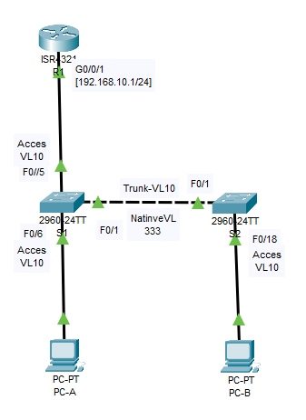
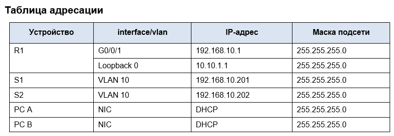
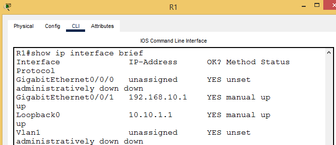
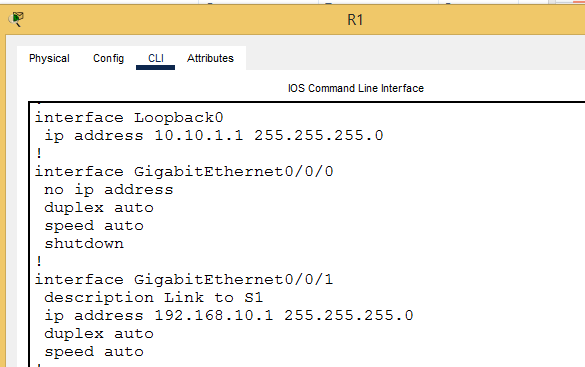
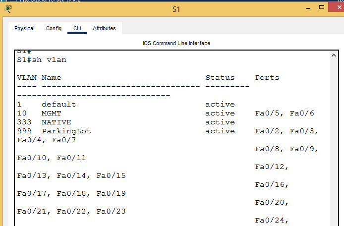
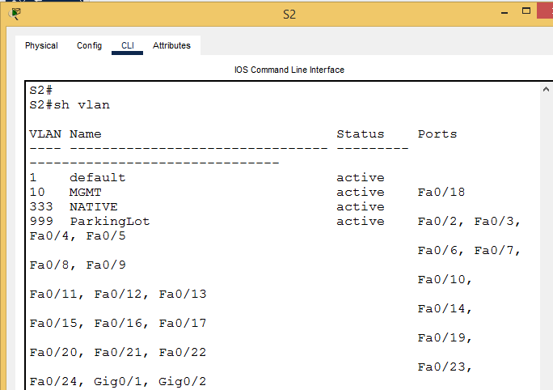

# Лабораторная работа - Конфигурация безопасности коммутатора 

## Топология





## Часть 1. Настройка основного сетевого устройства

**•	Создайте сеть.**

**•	Настройте маршрутизатор R1.**

**•	Настройка и проверка основных параметров коммутатора**

## Часть 2. Настройка сетей VLAN

**•	Сконфигруриуйте VLAN 10.**

**•	Сконфигруриуйте SVI для VLAN 10.**

**•	Настройте VLAN 333 с именем Native на S1 и S2.**

**•	Настройте VLAN 999 с именем ParkingLot на S1 и S2.**

## Часть 3: Настройки безопасности коммутатора.

**•	Реализация магистральных соединений 802.1Q.**

**•	Настройка портов доступа**

**•	Безопасность неиспользуемых портов коммутатора**

**•	Документирование и реализация функций безопасности порта.**

**•	Реализовать безопасность DHCP snooping.**

**•	Реализация PortFast и BPDU Guard**

**•	Проверка сквозной связанности.**

## Ход работы
## _____________________________________________________________________

## Часть 1. Настройка основного сетевого устройства

### Шаг 1. Создайте сеть.

**a.	Создайте сеть согласно топологии.**

**b.	Инициализация устройств**

## Шаг 2. Настройте маршрутизатор R1.

**a.	Загрузите следующий конфигурационный скрипт на R1.**
**Откройте окно конфигурации**
```
enable
configure terminal
hostname R1
no ip domain lookup
ip dhcp excluded-address 192.168.10.1 192.168.10.9
ip dhcp excluded-address 192.168.10.201 192.168.10.202
ip dhcp relay information trust-all
!
ip dhcp pool Students
 network 192.168.10.0 255.255.255.0
 default-router 192.168.10.1
 domain-name CCNA2.Lab-11.6.1
!
interface Loopback0
 ip address 10.10.1.1 255.255.255.0
!
interface GigabitEthernet0/0/1
 description Link to S1
 ip address 192.168.10.1 255.255.255.0
 no shutdown
!
line con 0
 logging synchronous
 exec-timeout 0 0
```
**b.	Проверьте текущую конфигурацию на R1, используя следующую команду:**
```
R1# show ip interface brief
```



**c.	Убедитесь, что IP-адресация и интерфейсы находятся в состоянии up / up (при необходимости устраните неполадки).**



## Шаг 3. Настройка и проверка основных параметров коммутатора

**a.	Настройте имя хоста для коммутаторов S1 и S2.**
```
hostname S1
```
**b.	Запретите нежелательный поиск в DNS.**
```
no ip domain-lookup
```
**c.	Настройте описания интерфейса для портов, которые используются в S1 и S2.**
```
interface FastEthernet0/1
 description TO-S2
!
interface FastEthernet0/5
 description TO-R1
!
interface FastEthernet0/6
 description TO-PC-A
```
**d.	Установите для шлюза по умолчанию для VLAN управления значение 192.168.10.1 на обоих коммутаторах.**
```
ip default-gateway 192.168.10.1
```
## Часть 2. Настройка сетей VLAN на коммутаторах.

**Шаг 1. Сконфигруриуйте VLAN 10.**

**Добавьте VLAN 10 на S1 и S2 и назовите VLAN - Management.**

**Шаг 2. Сконфигруриуйте SVI для VLAN 10.**

**Настройте IP-адрес в соответствии с таблицей адресации для SVI для VLAN 10 на S1 и S2. Включите интерфейсы SVI и предоставьте описание для интерфейса.**






