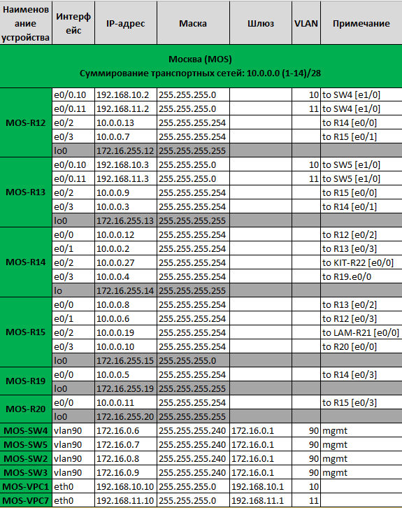
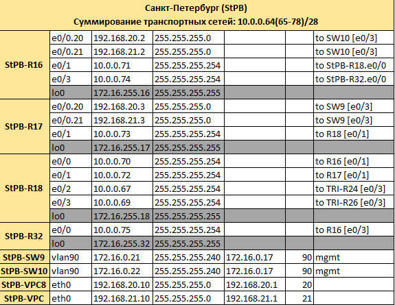
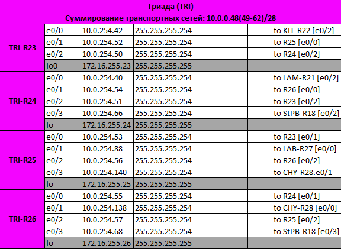
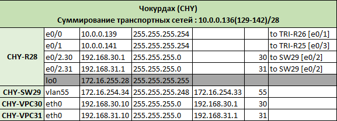
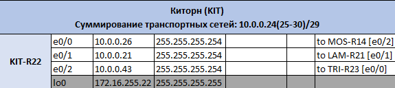
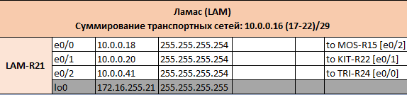

## Проектирование архитектуры сети

**Цель:**
 **распланировать адресное пространство, настроить IP на активных портах для дальнейшей работы над проектом и задокументировать адресацию.**

***1.Разработаете и задокументируете адресное пространство для лабораторного стенда.***

***2.Настроите ip адреса на каждом активном порту***

***3.Настроите каждый VPC в каждом офисе в своем VLAN.***

***4.Настроите VLAN/Loopbackup interface управления для сетевых устройств***

***5.Настроите сети офисов так, чтобы не возникало broadcast штормов, а использование линков было максимально оптимизировано***

***6.Используете IPv4. IPv6 по желанию***

---------------------------------------------------------------------------
**1. В ходе разработки схемы, для наглядности было принято решение внести маркировку интерфейсов оборудования в соответствии с адресацией.**

**Создано адресное пространство для оборудования. Данная таблица будет корректироваться при дальнейшей модификации схемы, будут добавлены дополнительные адреса по мере необходимости.**

- [Addr_table.xlsx](table/Addr_table.xlsx)

  
  
  
  
  
  

**Пункты 3,4,5 содержатся в конфигурациях, приведённых ниже**

**6. В проекте на данном этапе используется IPv4**

## Конфигурации сетевого оборудования:
### Москва:
- [MOS-R12](./config/MOS-R12)
- [MOS-R13](./config/MOS-R13)
- [MOS-R14](./config/MOS-R14)
- [MOS-R15](./config/MOS-R15)
- [MOS-R19](./config/MOS-R19)
- [MOS-R20](./config/MOS-R20)
- [MOS-SW2](./config/MOS-SW2)
- [MOS-SW3](./config/MOS-SW3)
- [MOS-SW4](./config/MOS-SW4)
- [MOS-SW5](./config/MOS-SW5)
- [MOS-VPC1](./config/MOS-VPC1)
- [MOS-VPC7](./config/MOS-VPC7)

### Санкт-Петербург
- [StPB-R16](./config/StPB-R16)
- [StPB-R17](./config/StPB-R17)
- [StPB-R18](./config/StPB-R18)
- [StPB-R32](./config/StPB-R32)
- [StPB-SW9](./config/StPB-SW9)
- [StPB-SW10](./config/StPB-SW10)
- [StPB-VPC](./config/StPB-VPC)
- [StPB-VPC8](./config/StPB-VPC8)

### Триада
- [TRI-R23](./config/TRI-R23)
- [TRI-R24](./config/TRI-R24)
- [TRI-R25](./config/TRI-R25)
- [TRI-R26](./config/TRI-R26)

### Чукордах
- [CHY-R28](./config/CHY-R28)
- [CHY-SW29](./config/CHY-SW29)
- [CHY-VPC30](./config/CHY-VPC30)
- [CHY-VPC31](./config/CHY-VPC31)
  
### Ламас
- [LAM-R21](./config/LAM-R21)

### Киторн
- [KIT-R22](./config/KIT-R22)

### Лабытнаги
- [TRI-R27](./config/LAB-R27)

