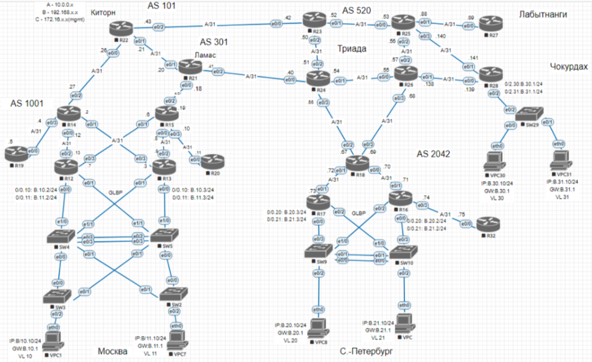

# Архитектура сети 

## Проектирование сети

**Цель:**
 **распланировать адресное пространство, настроить IP на активных портах для дальнейшей работы над проектом и задокументировать адресацию.**

***1.Разработаете и задокументируете адресное пространство для лабораторного стенда.***

***2.Настроите ip адреса на каждом активном порту***

***3.Настроите каждый VPC в каждом офисе в своем VLAN.***

***4.Настроите VLAN/Loopbackup interface управления для сетевых устройств***

***5.Настроите сети офисов так, чтобы не возникало broadcast штормов, а использование линков было максимально оптимизировано***

***6.Используете IPv4. IPv6 по желанию***

---------------------------------------------------------------------------
**1. В ходе разработки схемы, для наглядности было принято решение внести маркировку интерфейсов оборудования в соответствии с адресацией.**

**2. Создано адресное пространство для оборудования. Данная таблица будет корректироваться при дальнейшей модификации схемы, будут добавлены дополнительные адреса по мере необходимости.**

